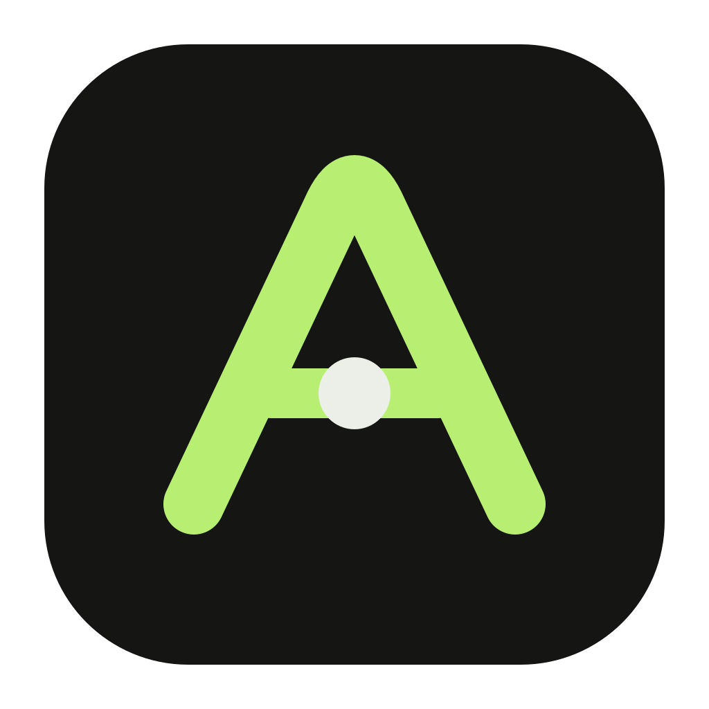

# Ait



Ait 是一个本地优先的多 Agent 管理器，目标是统一在线协作平台、本地 Agent 运行时和面向任务的管理界面。

当前仓库处于工程初始化阶段，实现语言固定为 Rust。核心概念与边界以 `docs/README.md` 中列出的 ADR 为准。

## 开始开发

```bash
cargo fmt --all --check
cargo clippy --workspace --all-targets -- -D warnings
cargo test --workspace

cd apps/desktop
pnpm install
pnpm run dev
```

## 本地 API 与 CLI

```bash
cargo run -p ait-daemon -- --database ./ait.sqlite3
cargo run -p ait-cli -- --help
cargo run -p ait-cli -- project list
cargo run -p ait-cli -- project register --id demo --name Demo --workdir /path/to/project
cargo run -p ait-cli -- agent create --id codex --name Codex --provider-id builtin-codex --model gpt-5.6-sol
cargo run -p ait-cli -- session create --id main --project-id demo --agent-id codex
cargo run -p ait-cli -- session send --session-id main --text-stdin < /path/to/prompt.txt
```

`--database` 指定全局目录数据库，默认是当前工作目录下的 `ait.sqlite3`；
正式 Desktop 使用 `<Electron userData>/ait.sqlite3`，开发版使用独立的
`ait-development.sqlite3`。对话、Session、Run 和进度保存在各项目的
`.ait/project.sqlite3`，并自动通过 Git `info/exclude` 排除。旧单文件库首次打开时
先生成 `*.pre-split.sqlite3` 备份再迁移，迁移时所有已注册项目目录必须可访问。
备份需要同时考虑全局库和项目库，详见 [存储与迁移约定](docs/decisions/NEC-235/adr-001-global-and-project-storage.md)。

daemon 按实体与操作暴露本地 HTTP API，例如 `POST /v1/project/register`、
`POST /v1/session/create`；可按 cursor 续读的 SSE 位于 `GET /v1/event/list`。CLI 通过
同一组 API 调用 application service。完整路由表见
`docs/decisions/NEC-166/entity-operation-http-api.md`。

按用户目标组织的操作步骤、失败恢复和当前行为差距见 [CLI 用户流程](workflows/README.md)。
对应验收测试运行 `cargo test -p ait-cli --test workflows`，覆盖真实 CLI 到 HTTP/SQLite 的完整路径。

CLI 按 `project`、`agent`、`session`、`message`、`run`、`cron`、`config`、`event`
分组，每一级都提供 `--help`；标量通过 flags 输入，多行文本支持 `--text-file` / `--text-stdin`。
Provider 操作位于 `agent provider`。CLI 使用全局 `--host` / `--port` 连接 daemon，默认 `127.0.0.1:7314`，协议固定 HTTP。
Provider 凭据使用 `agent provider save --secret-stdin`，不得粘贴到命令行。
`session send` 返回后必须检查 Run 的 `status` 与 `error`，`ok=true` 不代表执行完成。

新建和重置设置默认是 `permissions.sandbox=workspace_write`、`permissions.approval=on_request`。
已有权限选择会保留；需要修改时按 [WF-08](workflows/08-settings.md#设置新-run-的权限)
读取 settings 的最新 revision，用 `config set --expected-revision <revision> --input <完整values文件>` 保存。
新 Run 固定权限快照，仍受管理员上限约束。Codex 使用 native harness；OpenAI/DeepSeek/Gemini/MiniMax 使用
宿主工具循环，按精确 provider+model 目录与 HostTools 可执行能力求交。API 首版文件操作始终
限制在 Project 根内，`full_access` 也不能越出此边界；执行范围见 [WF-13](workflows/13-api-provider-tool-loop.md)。
API Agent 现在也执行 `webfetch` / `websearch`、Project-local `skill`、`todowrite`、
持久化 `question` / `plan_exit` 与有界前台 `task`；
命名、恢复和当前不支持的后台/跨模型子任务边界见 [NEC-313 ADR](docs/decisions/NEC-313/adr-001-aligned-api-agent-tools.md)。
CLI 边界决策见 [NEC-241 ADR](docs/decisions/NEC-241/adr-001-entity-cli.md) 与
[NEC-257 修订](docs/decisions/NEC-257/adr-001-cli-command-and-address-simplification.md)。
Gemini 使用原生 GenerateContent API；可在 Desktop 的 Settings → Models 中选择 Gemini，或用
`agent provider save --kind gemini --secret-stdin` 保存连接。省略 `--url` 时使用官方 API 根，
随后通过 `agent provider discover-models` 或 `refresh-models` 获取可选模型。
MiniMax 使用官方 OpenAI-compatible Chat Completions API；用
`agent provider save --kind minimax --secret-stdin` 保存连接。省略 `--url` 时使用国际 API 根
`https://api.minimax.io/v1`；中国区可显式设置 `https://api.minimaxi.com/v1`。

GitHub Release 会为 Linux x86_64 与 Apple Silicon 构建名为 **Ait** 的桌面产物；
版本准备、打标签、产物校验和故障恢复见 [发布操作指南](docs/operations/releasing.md)。

结构化指标位于 `GET /v1/metric/list`。Project 恢复使用项目目录中的
`.ait/project.sqlite3`，不再提供 JSON archive 导入导出接口。备份恢复、数据保留、附件清理与性能基准见
`docs/operations/reliability-security-observability.md`。

## Workspace

- `crates/domain`：纯领域模型与不变量。
- `crates/contracts`、`crates/ports`：进程无关契约与跨能力端口。
- `crates/application`：用例编排。
- `crates/workspace`：Project Workspace 的路径事实、Git baseline、Session worktree、lease 与目录创建契约。
- `crates/workspace-local`：上述契约的本机文件系统和 Git 适配器；边界见 [ADR-015](docs/decisions/adr-015-workspace-capability.md) 与 [NEC-253 ADR](docs/decisions/NEC-253/adr-001-project-workspace-port.md)。
- `crates/runtime`、`crates/scheduler`：Run 与调度生命周期。
- `crates/storage-sqlite`：SQLite 持久化适配器。
- `crates/providers`：统一 Provider 契约、契约测试工具、Mock 与 OpenAI-compatible Adapter。
- `crates/agent-adapters`：完整 Agent harness 适配器；首个实现为 Codex app-server。
- `crates/tools`、`crates/sandbox`：工具与进程隔离适配器。
- `crates/ipc`、`crates/api-http`：传输层。
- `bins/daemon`、`bins/worker`、`bins/cli`：可执行入口。
- `apps/desktop`：Electron 桌面工作台；main process 只通过 daemon 的本地 API 读写，renderer 只消费受限投影。

更完整的依赖方向见 `docs/decisions/NEC-154/adr-002-rust-workspace-runtime-architecture.md`。
