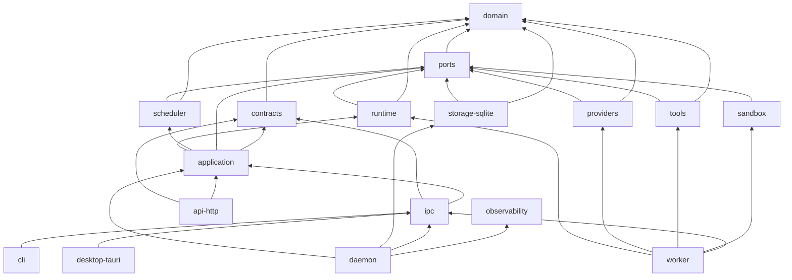
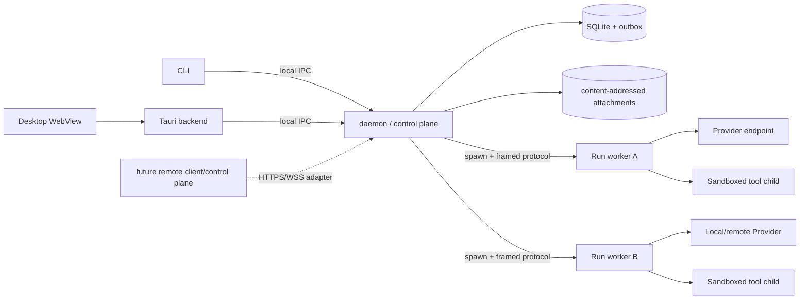
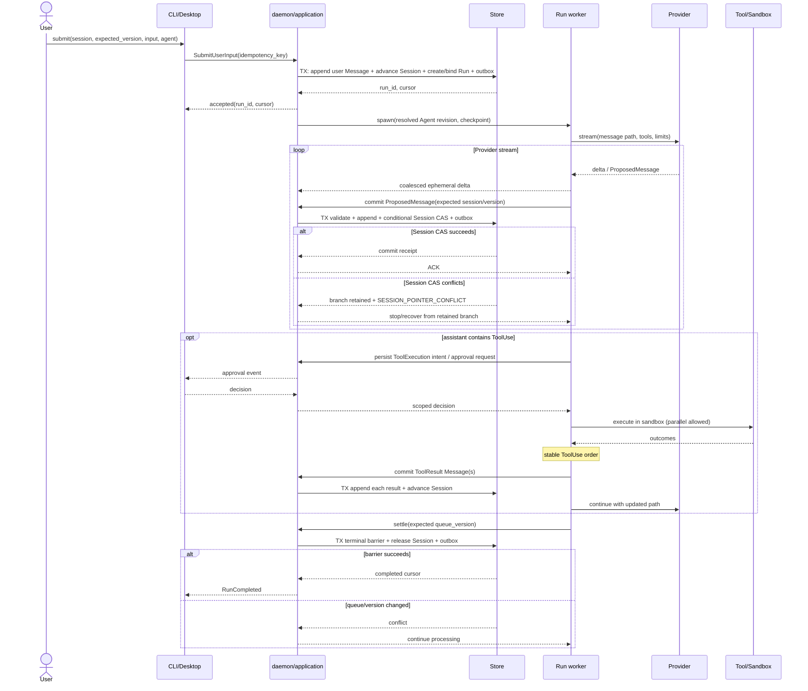
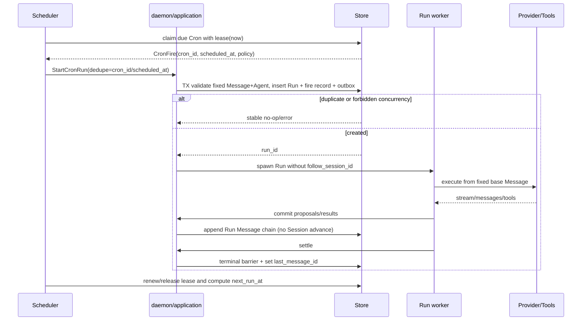

## ADR-002：Rust workspace 与 AI harness 运行时架构

- 状态：Proposed，待评审
- 日期：2026-09-02
- 依赖：ADR-001 v4（已确认）
- 适用范围：本地优先 AI harness/App 的 core、daemon、Run worker、CLI 与 desktop shell
- 非目标：不重新讨论 Rust 语言选型；不在本 ADR 固化数据库表结构、具体 Provider 字段或 UI 视觉方案
- 来源：NEC-154

## 1. 决策摘要

1. 采用 Cargo workspace，领域、端口、运行时、持久化与交付界面分层。`domain` 不依赖 Tokio、SQLx、HTTP、Provider SDK 或 UI；第三方库选择只存在于本 ADR 与 adapter crate。
2. 本地 `daemon` 是唯一控制面和 SQLite 写入者；CLI 与 desktop 都是薄客户端。每个 Run 由一个受监督的 `worker` 子进程执行，daemon 持久化状态、审批和事件，worker 不直接打开主数据库。
3. async runtime 选择 Tokio。每个 Run 使用一棵显式任务所有权树、分层 `CancellationToken`、`JoinSet` 与有界 channel；禁止脱离 supervisor 的 `tokio::spawn`。
4. Provider、Tool、Store、Scheduler、EventSink、Sandbox、Approval 都通过 object-safe、`Send + Sync` 的 Rust port 替换。进程内选择使用 `Arc<dyn Trait>`；高频纯算法可用泛型。第三方插件使用版本化进程协议，不使用 Rust `dylib` ABI。
5. 状态持久化使用 SQLite/WAL。每次状态转换与 durable event/outbox 同事务提交；实时 token delta 可合并并短暂存在内存，领域事实必须先落盘再广播。
6. 本地 IPC 选择跨平台 local socket（Unix domain socket / Windows named pipe）上的 length-delimited JSON envelope。desktop 的 Tauri backend 连接 daemon，再向 WebView 转发事件；WebView 不直接接触 daemon socket。
7. 未来多机器能力复用同一 application contract，但通过独立的 HTTPS/WSS transport adapter；本地模式不依赖云服务，远端也不能绕过本地 sandbox/approval。
8. Cron 是持久化触发器而非内存 timer。scheduler 用 lease + `cron_id/scheduled_at` 幂等键创建 Run；daemon 重启后按 misfire policy 补偿。
9. 采用 DeepSeek Harness 的可追踪、append-only 与能力 seam 思路；采用 Codex 的 app-server/客户端分离、流式 item lifecycle、背压和审批/沙箱分层；采用 Multica 与 Raft 的任务所有权、多 Agent/多机器控制面思路。拒绝“所有东西都是运行时插件”、以聊天记录代替领域模型，以及托管服务成为本地数据唯一权威。

## 2. ADR-001 约束映射

本 ADR 不改变领域含义，只规定实现承载方式：

- `Message` 是 append-only、不变节点；`Session` 是带 version 的可移动 ref。
- `ToolUse` 只存在于 assistant Message 的 sub-message；`ToolResult` 是特殊 user Message。
- `Run` 固定 `base_message_id + agent_revision`，重试、压缩、恢复与队列消费均沿用同一 `run_id`。
- 交互 Run 每次提交 Message 时，必须在同一事务内推进 Session；指针冲突保留分支而不覆盖。
- `completed` 只能由终止屏障原子提交；Cron Run 不跟随 Session。

实现中的 event、DTO、SQL row、Provider chunk 都只是上述领域对象的表示或事实，不得反向改变领域边界。发现不可映射的 Provider 协议时，新建兼容性 ADR。

## 3. Cargo workspace 与 crate 边界

建议目录：

```text
Cargo.toml
crates/
  domain/                  # 实体、值对象、不变量、稳定 ErrorCode；同步且纯
  contracts/               # 版本化 command/event/IPC DTO，domain <-> DTO 转换
  ports/                   # Provider/Tool/Store/... object-safe traits
  runtime/                 # Run supervisor、agent loop、终止屏障、恢复算法
  storage-sqlite/          # Store adapter、migration、outbox、FTS/附件索引
  providers/               # 内置 Provider adapters 与 contract-test kit
  tools/                   # Tool registry、execution policy、内置工具 adapters
  sandbox/                 # OS sandbox 与子进程生命周期 adapters
  scheduler/               # durable Cron claim/misfire/concurrency policy
  application/             # use case、授权、事务边界、组合 runtime/scheduler
  ipc/                     # local socket framing、握手、订阅与 client SDK
  api-http/                # 可选远程 HTTPS/SSE/WSS adapter，不供 domain 使用
  observability/           # tracing/metrics/redaction 初始化
bins/
  daemon/                  # composition root、单实例、DB owner、worker supervisor
  worker/                  # 每 Run 执行进程；仅通过协议访问 daemon
  cli/                     # clap client；不直接访问 SQLite
apps/
  desktop/src-tauri/       # Tauri backend + daemon client
  desktop/ui/              # 纯前端；只调用 Tauri commands/events
tests/
  contract/                # Provider/Tool/Store/Sandbox 可复用契约测试
  recovery/                # kill/restart/fault-injection
  benchmarks/              # 流式、并行工具、大树、IPC 背压
```

职责规则：

| crate | 可以知道 | 不可以知道 |
|---|---|---|
| `domain` | 领域 ID、实体、状态机、不变量、稳定错误码 | async runtime、SQL、HTTP、UI、SDK 类型 |
| `contracts` | domain 的公开投影、协议版本、cursor/envelope | SQL row、具体 Provider payload |
| `ports` | domain、异步 stream/future 抽象 | adapter 配置与实现细节 |
| `runtime` | domain + ports、Run 所有权与流程 | SQLite/HTTP/Tauri 具体类型 |
| adapters | 对应 port、第三方库 | 跨层调用另一个 adapter |
| `application` | use case、权限、事务编排 | UI 状态与具体传输 |
| binaries | 配置和依赖注入 | 新领域规则 |

依赖 DAG：



约束由 CI 检查：`domain` 的 `Cargo.toml` 不得出现 Tokio/SQLx/Axum/Reqwest/Tauri；adapter 之间不得直接依赖；只有 binary composition root 组装具体实现。

## 4. 进程拓扑与边界



### 4.1 daemon

- 持有单实例锁、SQLite writer/read pool、scheduler lease、event outbox 与所有 active Run supervisor handle。
- 是 Project/Session/Message/Run/Cron 的授权入口；CLI/UI 永不直接写 DB。
- 接收 worker 的 proposal/event，先校验领域不变量并事务提交，再 ACK。worker 不能宣称一个 Message 已存在，除非收到 commit ACK。
- daemon 崩溃不会把 worker 当作继续运行的权威；父进程死亡管道关闭后，worker 必须取消工具、写本地诊断并退出。新 daemon 以 DB checkpoint 恢复。

### 4.2 Run worker

- 默认每个 Run 一个短生命周期进程，隔离 Provider SDK、插件、工具 orchestration 的 panic、泄漏和阻塞。
- worker 接收冻结的 Agent revision、Run limits、workspace capability 与 resume checkpoint，不接收 DB 文件路径或主密钥。
- 工具默认再启动受 sandbox 约束的 child process。可信的纯内存工具可显式以内置 adapter 运行，但仍经过 Tool/Approval/Event port。
- 进程开销如果经 spike 证明不可接受，可池化“空闲、无状态 worker”；绝不复用一个 worker 内的 Run 可变状态。

### 4.3 CLI 与 desktop

- CLI 是脚本友好的 IPC client，提供结构化 JSON 输出和 cursor-based event follow。
- desktop 使用 Tauri 2 薄壳。Tauri backend 负责 daemon 发现、认证、协议转换与 OS 功能；WebView 仅消费 application DTO。
- core/runtime 不依赖 CLI/Tauri；删除 UI 后 daemon、Cron 与 CLI 仍完整工作。

### 4.4 单实例、发现与认证

1. daemon 启动先获取 OS advisory lock；lock 文件只存 protocol version、PID、socket name 与 instance nonce，不存 secret。
2. 若锁已持有，客户端读取 endpoint，完成 nonce challenge 和 peer-credential 校验后复用现有实例；不得盲目删除“陈旧”锁。
3. Unix 使用权限 `0600` 的 socket；Windows 使用仅当前用户 SID 可访问的 named pipe。跨平台抽象候选为 `interprocess`。
4. 本地协议握手包含 `protocol_major/minor`、client build、capabilities 与 max frame。major 不兼容直接拒绝，minor 通过 capability negotiation 降级。
5. future remote transport 必须使用 TLS、显式设备身份与 scope；不能复用“localhost 即可信”的假设。

### 4.5 IPC/API

本地 IPC 使用 length-delimited JSON，而不是换行 JSON：消息正文、工具输出和错误可能包含任意换行，且 frame size 可在解码前限制。统一 envelope：

```text
Request  { protocol, request_id, method, deadline?, idempotency_key?, body }
Response { request_id, ok, body?, error? }
Event    { subscription_id, cursor, run_id?, kind, durable, body }
Ack      { subscription_id, cursor }
```

- command/response 与 event subscription 分离成两个 logical stream，防止慢 UI 阻塞控制命令。
- durable event 带单调 cursor，可从 SQLite replay；ephemeral delta 允许合并或丢弃，并以 `snapshot_required` 通知客户端重取投影。
- frame 有硬上限；大附件通过 CAS/file handle 或分块 API 传输，绝不塞入单个 event。
- 远程 HTTP adapter 使用 Axum/Tower：command 为 versioned JSON API，单向流优先 SSE，真正双向控制才用 WebSocket。

### 4.6 升级与数据迁移

- binary 首先检查 `schema_version` 与 `minimum_reader_version`。旧程序看到新 schema 必须拒绝写入。
- migration 在 daemon 单实例锁内执行：停止接收新 Run → 等待/中断 active Run → SQLite online backup → 校验磁盘空间 → embedded forward migration → integrity check → 原子切换版本。
- migration 不做隐式 downgrade。回滚依赖升级前备份和旧 binary；附件 CAS schema 必须向前兼容。
- desktop 可升级 UI 与 daemon，但启动握手先做版本兼容检查；不允许两个版本同时写 DB。

## 5. 异步执行、监督与背压

### 5.1 每 Run 结构化并发

```text
DaemonSupervisor
└─ RunSupervisor(run_id, root CancellationToken)
   ├─ WorkerProcessMonitor
   ├─ ProviderPump(attempt token)
   ├─ PersistencePump
   ├─ ToolGroup
   │  ├─ ToolAttempt(call A token)
   │  └─ ToolAttempt(call B token)
   ├─ ApprovalWaiters
   └─ EventProjectionPump
```

所有 child 都登记在 supervisor 的 `JoinSet`。task 的唯一 owner 负责取消并 `join`；库代码不得创建无人持有的 background task。panic 转成 `RunAttempt` failure，由 supervisor 决定恢复或终止。

终止顺序：停止接收新 queue item → 取消 Provider 读取 → 禁止启动新工具 → 等待或终止现有工具 → 提交可确认结果/unknown outcome → 执行终止屏障 → 释放 Session ref → 关闭事件流。

### 5.2 channel 与背压预算

初始容量是配置而不是协议，必须由 spike 校准：

| 通道 | 建议初值 | 满载策略 |
|---|---:|---|
| daemon command ingress | 256 | 拒绝并返回 retryable `OVERLOADED` |
| worker semantic event | 128 | producer await；不能丢领域事实 |
| provider raw delta | 64 | 合并到 16 KiB 或 50 ms chunk；禁止无界缓存 |
| per-Run queue | 64 | API 返回 `RUN_QUEUE_FULL`，调用方保留输入 |
| per-client durable event | 256 | 断开并带 last cursor，重连 replay |
| per-client ephemeral delta | 64 | 合并/丢弃并发 `snapshot_required` |

SQLite/outbox 是 durable event 的权威；broadcast channel 只是低延迟提示。慢消费者不会反向拖死 Run，也不会造成不可恢复的数据缺口。

### 5.3 `Send`/`Sync` 与任务所有权

- daemon/worker 中跨 task 的 port：`Send + Sync + 'static`；返回 future/stream 也必须 `Send`。
- 每个 Run 的可变状态由 `RunSupervisor` 单独拥有，通过有界 command channel 修改；不建立“全局大 Mutex”。
- 禁止持有 `MutexGuard`、SQL transaction 或 borrowed Provider payload 跨 `.await`。
- blocking 文件/压缩/SDK 调用只在 adapter 中使用受限 `spawn_blocking` pool，并受 semaphore 和 cancellation deadline 限制。
- 事件和命令使用 owned DTO；大 bytes 用引用计数 buffer 或 CAS 引用，避免跨层 lifetime。

### 5.4 取消安全

- CancellationToken 分层：daemon shutdown → Run → attempt → tool。父取消向下传播，子取消不反向终止父 Run。
- “外部副作用前”先提交 `ToolExecution(intent, idempotency_key)`；副作用后提交 result。提交事务进入短暂 shielded settling 区，只受硬 deadline，不因普通取消中途 drop。
- drop future 不等于撤销 HTTP 请求或 OS 进程。无法证明未发生的副作用写为 `outcome=unknown`；非幂等工具不自动重放。
- Provider 断流从最后已提交 Message/checkpoint 建新 attempt；不重复已提交 Message。若 usage 无法确认则记录 `usage_estimate/unknown`，不能伪造精确值。
- `select!` 中控制消息、取消与输出的优先级显式测试；不能靠分支书写顺序形成隐含协议。

### 5.5 优雅退出

1. 关闭 IPC listener 并返回 `SERVER_DRAINING`；scheduler 停止 claim。
2. 给 active Run 发送 shutdown cancellation，等待配置的 grace period。
3. 对未结束 Run 持久化 checkpoint 或 `interrupted` attempt；杀死工具进程树和 worker。
4. flush outbox、SQLite WAL 与 tracing exporter；释放 socket/lock。
5. 超过 hard deadline 也必须先写可恢复标记，再退出。下次启动扫描非终态 Run 并按 recovery policy 处理。

## 6. 可替换 port 与分发策略

以下是形状约束，不是最终完整 API：

```rust
pub trait Provider: Send + Sync + 'static {
    fn capabilities(&self) -> ProviderCapabilities;
    fn stream(&self, req: ProviderRequest)
        -> BoxFuture<'static, Result<BoxStream<'static, Result<ProviderEvent, ProviderError>>, ProviderError>>;
}

pub trait Tool: Send + Sync + 'static {
    fn descriptor(&self) -> ToolDescriptor;
    fn execute(&self, ctx: ToolContext, input: ToolInput)
        -> BoxFuture<'static, Result<ToolOutcome, ToolError>>;
    fn reconcile(&self, key: IdempotencyKey)
        -> BoxFuture<'static, Result<ReconcileOutcome, ToolError>>;
}

pub trait Store: Send + Sync + 'static {
    fn load_run(&self, id: RunId) -> BoxFuture<'static, Result<RunSnapshot, StoreError>>;
    fn transact(&self, command: StoreCommand)
        -> BoxFuture<'static, Result<CommitReceipt, StoreError>>;
    fn replay(&self, cursor: EventCursor, limit: usize)
        -> BoxStream<'static, Result<DurableEvent, StoreError>>;
}

pub trait Scheduler: Send + Sync + 'static {
    fn claim_due(&self, now: Timestamp, owner: LeaseOwner, limit: usize)
        -> BoxFuture<'static, Result<Vec<CronFire>, SchedulerError>>;
}

pub trait EventSink: Send + Sync + 'static {
    fn publish(&self, events: Vec<DurableEvent>)
        -> BoxFuture<'static, Result<(), EventSinkError>>;
}

pub trait Sandbox: Send + Sync + 'static {
    fn spawn(&self, spec: SandboxSpec)
        -> BoxFuture<'static, Result<Box<dyn SandboxedChild>, SandboxError>>;
}

pub trait Approval: Send + Sync + 'static {
    fn decide(&self, request: ApprovalRequest)
        -> BoxFuture<'static, Result<ApprovalDecision, ApprovalError>>;
}
```

边界要求：

- `Provider` 只产出规范化 event，不返回 SDK object；Provider capability 在 Run 启动前验证并快照。
- `Tool` 的 `call_id + attempt + idempotency_key` 由 host 指定；tool 不写 Message/Session。
- `Store::transact` 接受领域 command，并原子返回 state version + durable cursor；不向 runtime 暴露 SQL transaction。
- `Scheduler` 只计算/claim fire；真正 `startRun` 仍由 application service 执行。
- `EventSink` 不是事实来源；失败由 outbox 重试，不能让已提交领域事务回滚。
- `Sandbox` 决定技术隔离，`Approval` 决定权限授权；批准不意味着绕过 sandbox，只能选择一个明确、更宽但仍受限的 profile。

分发决策：

- composition root 与运行期可选择组件：`Arc<dyn Trait>`。Provider/Tool/Sandbox 需要按 Agent 或平台动态选择，测试也需替换。
- 高频、同步、纯函数（路径投影、状态 reducer、策略组合）：泛型或普通函数，保留内联与静态检查。
- 不追求 Rust ABI 稳定；workspace 内 trait 是 source contract。外部 Provider/Tool 插件运行在子进程，以 versioned contracts + capability handshake 通信。
- `async fn in trait` 当前不作为公共 dyn port；显式 boxed future/stream 让 object safety、分配成本与 `Send` 约束可见。

## 7. 幂等、持久化与崩溃恢复

### 7.1 事务与 outbox

一次有效状态变更在同一 SQLite transaction 内完成：验证 expected version → 写 entity/state → 写 immutable domain event → 写 outbox → commit。commit receipt 含新 version/cursor；提交后 dispatcher 才广播。

对于交互 Message，单个 transaction 先校验其 parent/Run seq 并插入不可变 Message，再以 expected pointer/version 条件推进 `Session.current_message_id/version`。CAS 成功时，同事务更新 `Run.last_message_id/run_seq` 与 outbox；CAS 失败时，不回滚已经校验过的 Message，而是在同事务把它记录为未被 Session 跟随的可恢复分支，写入 pointer-conflict event，保持 Session 与 Run head 不变并返回 `SESSION_POINTER_CONFLICT`。因此既不会覆盖 Session，也不会丢失已经生成的分支。

### 7.2 外部副作用

| 阶段 | 持久化状态 | crash 后行为 |
|---|---|---|
| 尚未执行 | intent + idempotency key | 幂等工具可执行；非幂等按 policy 决定 |
| 已发送，未确认 | `outcome=unknown` | 先 `reconcile`；不能自动重复非幂等调用 |
| 已确认 | final result + digest | 仅重放结果，不再执行 |
| ToolResult Message 已提交 | `tool_result_message_id` | 下一模型 step 从该 Message 继续 |

Provider 请求也有 attempt id。恢复不会把同一 token delta 当领域事实；只有完整、校验后的 ProposedMessage 才参与 Message tree。

### 7.3 daemon 启动恢复

1. 完成 DB integrity/schema 检查并取得 scheduler lease。
2. 扫描非终态 Run 与 attempt；将失去 worker heartbeat 的 attempt 标为 interrupted。
3. 释放仅属于已终态 Run 的残留 Session ref；非终态 ref 保留到恢复成功或显式失败。
4. 对 unknown tool effect 先 reconcile/请求人工；对安全可恢复 Run 从最后 committed Message/checkpoint 启动新 attempt。
5. 重放 outbox；event consumer 以 cursor 去重。
6. 恢复 scheduler，按每个 Cron 的 misfire/concurrency policy 产生唯一 fire。

### 7.4 终止屏障

只有 Store transaction 能把 Run 写为 terminal。command 必须携带 expected `queue_version`、pending tool count、retry/checkpoint generation 与最后持久化 seq；任一值变化则返回 conflict，supervisor 回到 processing。所有终态条件式释放匹配的 `Session.active_run_id`。

## 8. 时序图

### 8.1 交互 Run



并行 ToolUse 可以同时执行，但 ToolResult Message 按 assistant sub-message 中的稳定顺序串行提交，满足 ADR-001。

### 8.2 Cron Run



## 9. 技术库候选与选择

版本由实现时的 `Cargo.lock` 与 MSRV ADR 固定；下表选择 API family，不把 semver 写进领域类型。

| 领域 | 选择 | 候选/拒绝 | 依据与边界 |
|---|---|---|---|
| async runtime | `tokio`, `tokio-util::CancellationToken`, `JoinSet`, bounded `mpsc/watch` | async-std、smol | Provider/HTTP/IPC 生态与监督原语更完整；禁止裸 spawn，把结构化并发规则封装在 runtime |
| stream | `futures-core`/`futures-util` boxed stream | 自定义 callback | Provider 与 IPC 可组合、可 backpressure；对外不泄露具体 SDK stream |
| serialization | `serde` + `serde_json`；IPC length-delimited | protobuf/tonic、postcard、bincode | JSON 可调试、schema 演进容易；bincode 不适合长期兼容；大 payload 用 CAS。未来远程高吞吐可另加 protobuf adapter |
| error | domain `ErrorCode` + typed details；crate 内 `thiserror`；binary 边界 `anyhow`；CLI 可选 `miette` | 全栈 `anyhow`、字符串错误 | 稳定错误语义跨 IPC；保留 source chain 但默认脱敏，不把 SQLx/Reqwest error 暴露给调用者 |
| SQLite | `sqlx` SQLite + embedded migrations；单 writer actor + 小 read pool | `rusqlite`、Diesel、SeaORM | async 集成、显式 SQL、migration/test 支持；复杂树查询不需要 ORM。若 spike 显示 SQLx worker/取消语义不满足，再以 Store contract A/B `rusqlite` |
| SQLite mode | WAL、foreign_keys、busy_timeout；同步级别由 durability profile 配置 | 多进程直接写 DB | daemon 唯一写入者减少锁争用；备份/恢复可控 |
| Provider HTTP | `reqwest` + rustls，`bytes`，显式 SSE decoder | 各厂商 SDK 直接进入 runtime | 统一 timeout、redaction、stream/cancel；厂商 SDK 只能在 adapter 内，必须通过 contract tests |
| remote API | `axum` + `tower`/`tower-http`; SSE 优先，WSS 按需 | Actix、tonic-only | 与 Tokio/Hyper 一致，middleware 适合 auth/limit/tracing；不把 HTTP 用作本地域模型边界 |
| local IPC | `interprocess` local socket + `tokio-util::codec::LengthDelimitedCodec` | localhost TCP、tarpc、tonic UDS | Unix/Windows 统一，避开端口/防火墙；自有小协议便于 cursor event。上线前必须做 Windows named pipe spike |
| observability | `tracing`, `tracing-subscriber`; 可选 OpenTelemetry/metrics exporter | `println!`、把 telemetry 当事实源 | span 统一关联 project/session/run/attempt/tool；secret 和原始 prompt 默认不进入 span |
| scheduler | 轻量 cron parser + 自有 durable scheduler/lease | `tokio-cron-scheduler` 作为权威 | 内存 timer 无法满足 crash/misfire/dedupe；parser 仅解析表达式，语义由 domain/application 决定 |
| CLI | `clap` + IPC client | CLI 直接链接 storage/runtime | 自动化稳定，且保持 daemon 单写者/单实例 |
| desktop | Tauri 2 薄 backend | Electron 内嵌另一套 core、WebView 直连 DB | Rust 复用与发布体积；UI 可独立演进，core 不依赖 Tauri |
| ID/time | typed newtype；adapter 内 `uuid` v7、`time` | 裸 String/chrono 类型贯穿领域 | 可排序 ID 利于索引；第三方类型不成为协议不变量 |
| secret | OS keychain adapter（候选 `keyring`）+ `credential_ref` | SQLite 明文 | 领域与导出只见引用；worker 获得短时、最小 scope material |
| testing | `proptest`, `loom`（并发核心）, fault injection, golden protocol schema | 只做 happy-path e2e | 状态机、CAS、取消与重启需要系统验证；loom 仅用于小型同步原语模型 |

## 10. 参考系统设计矩阵

参考快照见第 13 节。矩阵中的“采用/改造/拒绝”是本项目决策，不代表参考系统优劣。

### 10.1 Multica（当前工作区可观察契约）

| 维度 | 观察 | 决策 |
|---|---|---|
| Session/Message | chat、issue thread 与 run messages 分离；issue 是可回访工作记录 | **改造**：保留“协作记录/执行记录分离”，但模型上下文由 ADR-001 Message tree 唯一表示 |
| run loop | issue assignment 触发 task run，结果回写 issue；状态与 run 生命周期不是同一概念 | **采用**：Run 与用户工作项/Session 分离，执行结果通过 durable event 投影 |
| tool calling | agent 通过受控工具/CLI 操作 workspace | **采用**：所有 side effect 走 ToolExecution、审批、幂等与审计 |
| 审批/沙箱 | runtime 给每次调用明确 filesystem/network/approval profile | **采用**：Sandbox 与 Approval 两个 port，授权不可隐式扩大技术边界 |
| 调度 | autopilot 可由 schedule/webhook/manual 触发 | **改造**：MVP 先做 durable Cron；webhook/manual 复用 Trigger adapter，领域仍只创建 Run |
| 多 Agent/多机器 | issue 可路由到 agent/squad，本地 runtime 执行，task 可追踪 | **采用**：控制面/执行面分离；先本地 worker，协议为未来 machine registration 留能力握手 |
| 持久化 | issue、comment、task/run、metadata 是平台记录 | **改造**：本地 SQLite 是权威；远端同步是可选 adapter，不是启动依赖 |
| UI | issue board/thread 承担认领、进度、review 与交付 | **采用**：desktop 投影 Project/Session/Run/Cron；长任务必须可离开 UI 后继续 |

### 10.2 Slock / Raft

名称已核实：这里指 `slock.ai` 后更名的 `raft.build` 人类-Agent 协作产品，不是 Raft 共识算法，也不是 `raft.ai` 物流平台。

| 维度 | 观察 | 决策 |
|---|---|---|
| Session/Message | channel/thread/DM 是共享协作面；agent 有持续身份与记忆 | **改造**：Agent 身份/配置持久化，但模型历史仍是 Message tree，聊天频道不能成为隐藏事实源 |
| run loop | 长驻 agent 在本地 Computer 上由不同 runtime 驱动 | **改造**：daemon 长驻，Run worker 短驻；Agent 身份不等同 OS 进程 |
| tool calling | runtime 自带工具，Raft 位于协作层 | **采用** runtime adapter 思路；**拒绝**把各 runtime 的工具语义直接泄露到 domain |
| 审批/沙箱 | 主要由选定的本地 runtime/Computer 承担 | **改造**：宿主必须有统一 Sandbox/Approval contract，不能只相信外部 runtime |
| 调度 | reminders/持续 agent 支持周期工作 | **改造**：使用可审计 Cron fire + Run，不以聊天提醒作为执行权威 |
| 多 Agent/多机器 | 多 runtime、多 Computer、task claim、线程协作 | **采用**：agent/runtime/machine 解耦、单 owner、防重复认领；future remote worker 复用该模型 |
| 持久化 | server 保存协作状态，本地保留 workspace/runtime | **拒绝** hosted server 作为本地项目唯一权威；可选同步只复制明确事件 |
| UI | chat-as-workspace，task board + review | **改造**：借鉴协作 UX，但本产品主导航是 Project/Message tree/Session/Run，不让聊天淹没可恢复状态 |

### 10.3 DeepSeek Harness

| 维度 | 观察 | 决策 |
|---|---|---|
| Session/Message | append-only typed SessionEvent 是单一事实源，模型 history 由 log 推导 | **采用** append-only、replay、projection；**改造**为 Message tree + 独立 Run event/outbox，避免把所有事实塞进一个线性 session |
| run loop | agent-loop、model、tool、session、storage、scheduler 等能力均由 Cordis plugin 组合 | **改造**：稳定 Rust ports + composition root；只让 adapter 可插拔，领域状态机不可被插件改写 |
| tool calling | registry + pre/execute/post/finalize pipeline，模型可见事实写回 log | **采用** guarded pipeline 与先持久化后继续；工具输出规范化为 ToolResult Message |
| 审批/沙箱 | approval 与 sandbox 是可组合 seam，缺失 answerer fail closed，审批有 audit event | **采用** fail-closed、一次性明确授权与审计；审批不能默认成为持久宽授权 |
| 调度 | scheduling 也是 plugin capability | **改造**：parser/adapter 可换，durable Cron 状态机固定在 application/domain |
| 多 Agent/多机器 | 支持 subagent/workflow，但主要是单 harness composition | **改造**：subagent 创建普通 Run/child relation；跨机器由 control-plane transport 处理 |
| 持久化 | JSONL/SQLite backend 可换，flush checkpoint 与 crash recovery | **采用** persistence seam/replay；主产品固定 SQLite 作为 MVP 权威以简化事务和树查询 |
| UI | Web UI/trajectory 与 core 同样以 plugin 组合 | **拒绝** UI 成为 runtime plugin；UI 是薄 adapter，删除后 core 行为不变 |

不采用“everything is a plugin”的原因：Rust 本地 App 更需要可证明的依赖 DAG、稳定不变量和可控升级。允许插件通过声明合并扩张领域事件 vocabulary 会削弱 schema migration 与跨版本恢复。

### 10.4 OpenAI Codex

| 维度 | 观察 | 决策 |
|---|---|---|
| Session/Message | app-server 暴露 Thread/Turn/Item，支持 resume/fork/read 与分页历史；rollout 可持久化 | **改造**：借鉴 lifecycle/projection，但坚持 Session ref + Message tree；fork 不复制历史 |
| run loop | app-server 独立于 UI，turn 产生 item started/delta/completed，支持 interrupt/steer | **采用** server/client 分离和 event lifecycle；**改造**为 Run 终止屏障，模型返回不等于 Run completed |
| tool calling | command/file/tool 都是流式 item；dynamic tool 有 request/response | **采用** request id、call id、started/completed；ToolResult 仍遵守 ADR-001 Message 语义 |
| 审批/沙箱 | approval policy 与 sandbox profile 分层，审批由 server-initiated request 回客户端 | **采用**双层边界、请求作用域和一次/会话策略；MVP 仅做一次授权，持久 grant 另立 ADR |
| 调度 | Codex core 主要聚焦交互 turn，不是本项目 durable Cron 模板 | **拒绝**从交互 loop 推导调度；Cron 由独立 scheduler/Store contract 实现 |
| 多 Agent/多机器 | app-server 可承载 subagent/thread；核心仍偏单机 coding runtime | **改造**：本地 worker contract 预留 parent Run/machine capability，不把 UI thread 当调度单位 |
| 持久化 | rollout JSONL 可 replay/inspect，app-server 提供持久历史 API | **采用**可检查 event 与 cursor pagination；**改造**为 SQLite transaction + outbox 支撑 Session CAS |
| UI | TUI/VS Code 等通过 app-server protocol 驱动 core | **采用** transport-neutral core + typed client；本地协议也必须有 bounded queues/overload error |

## 11. 最小技术 spikes 与验收基准

所有 benchmark 必须记录 CPU、内存、磁盘、OS、Rust/toolchain、crate lockfile 与数据生成 seed；阈值在同一参考机器比较。

| 优先级 | spike | 验收基准 |
|---:|---|---|
| P0 | 60 分钟 Provider 流式响应 + 慢 UI | 2,000,000 raw deltas 输入；语义事件零丢失；RSS 稳态增长 < 128 MiB；UI 停读不阻塞 Run；重连从 cursor 恢复；取消到 socket/worker 停止 p95 < 2 s |
| P0 | 并发 ToolUse 稳定提交 | 单 assistant Message 32 个 tool calls，混合成功/失败/拒绝/超时；最大并发可配；10,000 轮无死锁；ToolResult 永远按 sub-message 顺序且每 call 最多一个 final result |
| P0 | kill -9 崩溃恢复矩阵 | 在 intent 前后、外部 effect 后、Message commit 前后、终止屏障前后逐点 kill；重启后无重复 committed Message；非幂等 unknown effect 不自动重放；Run/Session ref 最终一致 |
| P0 | 大 Message forest 读取 | 1,000,000 Message、最大深度 10,000、混合分支；热缓存 path 读取 p95 < 100 ms，children 分页 p95 < 100 ms，FTS p95 < 250 ms；单请求额外 RSS < 256 MiB；禁止递归栈溢出 |
| P0 | SQLite 单 writer + outbox | 64 个并发 Run proposal，持续 10 分钟；无 `database locked` 泄漏到 domain；每个 commit cursor 严格单调；crash 后 outbox 可重复投递但 consumer 去重 |
| P0 | local IPC 跨平台 | macOS/Linux UDS 与 Windows named pipe 均通过：握手、64 MiB 拒绝、慢订阅、daemon 重启、peer auth；过载返回稳定 retryable error |
| P1 | worker 隔离与进程树取消 | worker panic/OOM/Provider hang/工具 fork child 均不杀 daemon；取消后进程树在 3 s 内清理；遗留 attempt 可恢复 |
| P1 | Provider contract | 一个远程 Provider + 一个 mock/local Provider 跑同一套：stream/tool/usage/stop reason/retry/cancel/malformed frame；不支持能力在 Run 前失败 |
| P1 | migration/rollback | 从最近两个 schema fixture 前向升级；升级前备份；中途断电模拟后原 DB 或新 DB 至少一个完整可启动；新 schema 被旧 binary 拒写 |
| P1 | scheduler 时钟与 lease | DST 前后跳、daemon 离线 24h、双 daemon 竞争、allow/forbid/replace；每个 `cron_id/scheduled_at` 最多一个 Run，misfire 与配置一致 |
| P2 | dynamic vs generic dispatch | Provider/tool 典型 payload 下比较 boxed 与 generic；若 dyn overhead < 总 Run CPU 的 1%，保留可替换性；否则只优化内部纯热路径，不破坏 port |

P0 全部通过才开始完整 UI。任何 spike 若改变 ADR-001 领域边界，必须先新建 ADR，而不是在 adapter 中打补丁。

## 12. 实施顺序与完成定义

1. 建 workspace 骨架、依赖检查、domain/contracts/ports 和 mock contract kit。
2. 实现 SQLite Store、事务/outbox、projection 与大树 benchmark。
3. 实现 daemon 单实例、IPC handshake/cursor replay、CLI health/run inspect。
4. 实现 worker supervisor、mock Provider、Tool/Sandbox/Approval 与 P0 fault tests。
5. 实现一个远程 Provider、流式/并发工具、终止屏障和恢复。
6. 实现 durable scheduler/Cron；之后接 Tauri thin shell。
7. P0/P1 通过后，再开启 remote machine transport 与第三方进程插件协议。

本 ADR 的实现完成定义：core 在无 UI、无特定 Provider 的情况下可用 mock adapter 完成 interactive/Cron Run；替换 Store/Provider/Tool/Scheduler/Sandbox/Approval 不修改 domain/runtime；kill/restart、backpressure、CAS 与幂等基准可重复通过。

## 13. 参考快照与来源

本节锁定“比较的是哪个项目”，避免同名误引。访问日期均为 2026-09-02。

- **领域基线**：NEC-150 附件 `adr-001-core-domain-model-v4.md`，已由产品确认；本 ADR 的本地副本仅作为输入，不是新的交付版本。
- **Multica**：本工作区 issue/task/runtime CLI 的可观察契约与 NEC-144/150 的实际阶段流转。没有提供可引用的公开源码 commit，因此只比较外部可观察行为，不推断内部存储实现。
- **Slock/Raft**：官方页面明确 Slock 已更名为 Raft：<https://raft.build/events/shanghai-user-meetup/>。产品文档仓库为 <https://github.com/botiverse/raft-docs/tree/67e4e2473e51ed4ffddcdfdc9aac4f17edfb2b75>；重点参考 runtime、tasks、external agents 文档。此处不是 Raft consensus，也不是 <https://raft.ai/>。
- **DeepSeek Harness**：官方仓库快照 <https://github.com/deepseek-ai/deepseek-harness/tree/49a606bc5b5934603f22a26957a07dc799ab0291>；重点参考 `docs/architecture.md`、`docs/subsystems/{core,session,persistence,approval,shell}.md` 与官方概览 <https://www.deepseek.com/harness/en/>。该项目处于 developer preview，公开说明存在 breaking changes，因此只吸收原则，不依赖其 plugin API。
- **OpenAI Codex**：官方仓库快照 <https://github.com/openai/codex/tree/8d32abcd017d06511b46050cff9dbba8738fc2fa>；重点参考 `codex-rs/app-server/README.md`、`codex-rs/rollout/src/recorder.rs`、`codex-rs/core/src/tools/sandboxing.rs`。借鉴的是 app-server、rollout、approval/sandbox 结构，不复制其 Thread/Turn 领域模型。
- **Rust 库资料**：Tokio <https://tokio.rs/>；SQLx <https://docs.rs/sqlx/>；Axum <https://docs.rs/axum/>；interprocess local socket <https://docs.rs/interprocess/latest/interprocess/local_socket/>；版本只在实现 lockfile 固定。

## 14. 后果与待单独决策

正面后果：core 与 UI/provider 解耦；Run 崩溃边界清晰；本地数据可恢复；后续多机器可以沿用 command/event contract；测试可以注入 Store/Provider/Clock/Sandbox。

成本：每 Run 进程和 IPC 增加复杂度；SQLite 单 writer 需要显式背压；自有协议需要 schema/compatibility tests；Windows sandbox/named pipe 需要真实环境验证。

不在本 ADR 拍板、但实现前需单独记录：

- OS sandbox 的平台级实现与降级矩阵（尤其 Windows）；没有可用 backend 时必须 fail closed。
- 持久 approval grant 的 scope、撤销与审计；MVP 只支持 request/Run 级授权。
- future remote machine 的身份、租约、离线语义与端到端加密。
- SQLite schema/索引/GC 的最终 DDL，由持久化 ADR 决定，但必须满足本 ADR 的 transaction/outbox contract。
- Provider 统一协议的完整字段与 capability matrix，由 Provider Adapter ADR 决定。
