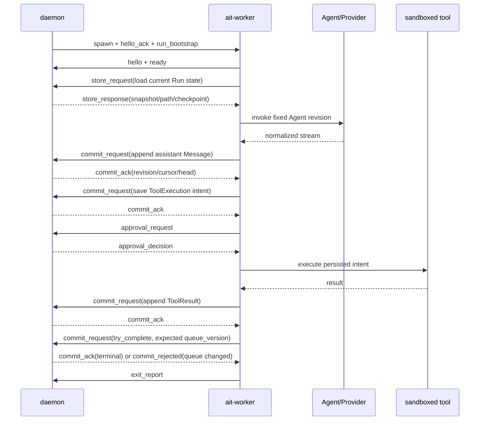

## ADR-001：`ait-worker` 职责与 daemon 交互契约

- 状态：Proposed
- 日期：2026-09-04
- 依赖：ADR-001 v4、NEC-151 ADR-002/003、NEC-154 ADR-002
- 范围：本地单机、每个 Run 一个短生命周期 worker 的首版实现
- 非目标：远程 worker 调度、worker 池化、修改核心领域模型、定义用户侧 API
- 来源：NEC-169

## 1. 决策摘要

1. `ait-worker` 是单个 Run 的短生命周期执行进程，不是新的领域实体，也不对 CLI、Desktop 或远程客户端暴露公共 API。
2. daemon 创建并监督 worker，继续作为唯一控制面、SQLite 写入者和最终状态权威；worker 不接收数据库路径，也不能直接修改 Message、Session、Run 或 outbox。
3. worker 运行 `ait-runtime::RunCoordinator`，装配具体 Agent adapter、Provider、Tool、Sandbox，并用 daemon RPC adapter 实现 `RunStore` 与 `RunApproval` port。所有 durable state 变更必须收到 daemon commit ACK 后才能继续。
4. 首版 transport 使用 daemon 创建的子进程 stdin/stdout：双向 length-delimited JSON frame，stderr 仅输出脱敏诊断。stdin EOF 表示父进程失联，worker 必须取消整棵任务树并退出。
5. 启动时先协商协议与能力，再由 daemon 下发只读的 `RunBootstrap`。bootstrap 固定 Run、Agent revision、权限/资源限制、worker lease 与恢复 checkpoint；worker 不接受运行中修改 Agent 配置。
6. worker 只产生提案和执行结果。跨进程消息不直接复用 SDK object，也不把 token delta 当作领域事实；完整、校验后的 Message、ToolExecution 和 checkpoint 才能提交。
7. stale worker 由 `worker_instance_id + lease_epoch` 拦截。daemon 对每个 mutation 使用 `operation_id` 去重并校验 expected version/sequence；ACK 丢失时由新 worker 从已提交状态恢复，而不是猜测提交结果。
8. 取消采用 daemon → Run → attempt → tool 的分层传播。daemon 同时拥有 OS 进程树兜底清理；普通取消不得中断已经开始的短事务结算。

## 2. 模块定位

```text
CLI / Desktop
      │ public command/event API
      ▼
daemon ───────────────► SQLite + outbox
  │  ▲                    唯一 durable authority
  │  │ private worker protocol
  ▼  │
ait-worker (one Run)
  ├─ RunCoordinator
  ├─ Agent adapter / Provider
  ├─ Tool registry
  └─ Sandbox ─────────► tool child process tree
```

worker 与 daemon 的边界是“执行面向控制面提交状态转换”，不是两个对等数据库副本。worker 进程死亡只会丢失尚未确认的流式增量和内存状态；daemon 已 ACK 的状态必须足以启动新的 worker 恢复同一个 Run。

## 3. 功能列表

### 3.1 首版必须提供

| 能力 | worker 职责 | daemon 职责 |
| --- | --- | --- |
| 进程启动与握手 | 报告 build、协议版本、能力和最大 frame | 生成 worker identity/lease，校验兼容性并下发 bootstrap |
| Run 装配 | 按固定 revision 选择 Agent adapter、Provider、Tool 与 Sandbox | 解析并固定 Agent revision、限制与工作区授权 |
| 上下文读取 | 通过 RPC 分页读取 Run snapshot、Message path、attempt 与工具状态 | 从权威 store 返回版本化、边界校验后的 DTO |
| Agent 执行 | 调用 Codex harness 或 Provider，归一化事件，组装完整 ProposedMessage | 不解释供应商 SDK 事件；验证完整提案并持久化 |
| 工具编排 | 在 intent 已 ACK 后执行；支持并行工具、稳定结果顺序和 reconcile | 原子保存 ToolExecution intent/result，并执行审批决策 |
| 审批 | 发起审批请求并可恢复地等待决定 | 持久化请求/决定，并从 UI/策略层取得授权 |
| Run 生命周期 | 驱动 retry、compaction、checkpoint、queue drain 和终止屏障请求 | 原子提交状态，检查 queue version，决定能否 terminal |
| 取消与超时 | 停止 Provider，禁止新工具，回收子任务并报告可确认结果 | 发取消命令、记录 durable 状态、超时后清理进程树 |
| 崩溃恢复 | 根据 bootstrap/checkpoint 和 daemon 当前状态重建 attempt | 识别 heartbeat/EOF，标记 interrupted，更新 lease 并启动新 worker |
| 背压 | 对 semantic event/RPC 使用有界队列；仅合并 ephemeral delta | durable event 落 outbox；慢客户端不能反压 worker |
| 可观测性 | 输出结构化、脱敏的 run/attempt/call 关联信息 | 汇总日志、指标与最终错误；不记录 prompt、工具正文或 secret |

### 3.2 明确不属于 worker

- 不创建 Project、Agent、Session、Cron，也不处理用户侧 command/SSE。
- 不打开主 SQLite、附件根目录或 daemon 单实例锁。
- 不决定 Message/Session/Run 的领域合法性，不自行宣告 Run completed。
- 不调度 Cron、不认领 Run、不在多个 Run 间共享可变状态。
- 不保存长期凭证，不把 provider token、登录态或工具 secret 写入 checkpoint、日志或错误。
- 不接受来自 CLI/Desktop 的直接连接；任何控制都必须经过 daemon。

### 3.3 后续能力，首版不实现

- 空闲无状态 worker 池与进程预热。
- 跨机器 lease、网络断线重连和远端 attestation。
- 多 Run 同进程、worker 自主拉取任务、动态加载 Rust `dylib` 插件。
- 用 worker 协议替代公共 HTTP/IPC contract。

## 4. 对外交互方式

### 4.1 启动入口

worker 只提供一个受管模式：

```text
ait-worker --stdio --protocol-major 1
```

Run 数据、凭证、工作目录和权限不得出现在命令行参数或环境变量中。daemon spawn 后立即建立协议；未在 handshake deadline 内完成协商就终止该 worker。worker 不提供 daemonize、listen address 或直接运行某个 Run ID 的用户入口。

首版使用标准输入/输出是因为它天然私有、跨平台、便于父进程检测 EOF，也不需要为每个 Run 分配可发现 endpoint。stdout 只能写 protocol frame；普通日志写 stderr。若未来改成 socket/pipe，envelope 和语义保持不变，只替换 framing transport。

### 4.2 Framing 与 envelope

每个 frame 为 `u32` big-endian 长度加 UTF-8 JSON body。双方在握手时协商 `max_frame_bytes`；初始上限建议 8 MiB，Message path 按页/块传输且单块不超过协商上限。未知 optional field 必须忽略，未知 required capability 或消息 kind 必须以协议错误终止。

```text
Envelope {
  protocol_major,
  protocol_minor,
  worker_instance_id,
  lease_epoch,
  run_id?,
  message_id,        // 本连接单调递增、用于追踪
  reply_to?,         // RPC response/ack 对应的 message_id
  operation_id?,     // mutation 幂等键
  kind,
  body
}
```

- `protocol_major` 不一致直接拒绝；minor 版本通过 capabilities 降级。
- frame 超限、JSON 无效、ID 与 bootstrap 不一致或 sequence 回退均视为 fatal protocol error。
- `operation_id` 在同一 Run 内稳定；daemon 对重试返回原 commit receipt，不重复执行 mutation。
- secret-bearing bootstrap field 的 Rust 类型必须固定脱敏 `Debug`，禁止实现通用持久化/导出转换。

### 4.3 消息集合

daemon → worker：

| kind | 含义 |
| --- | --- |
| `hello_ack` | 选择协议 minor、frame 上限和 capabilities |
| `run_bootstrap` | 固定 Run/Agent revision、lease、limits、workspace capability、checkpoint 与最小 scope credential grant |
| `store_response` | 对只读状态请求的分页结果 |
| `commit_ack` / `commit_rejected` | durable mutation 的 receipt 或稳定错误；receipt 含 revision/cursor/current Run head |
| `approval_decision` | 对已持久化 ToolExecution 的 approved/denied/pending 决定 |
| `cancel` | 携带 reason、grace deadline 与 hard deadline 的协作取消 |
| `shutdown` | daemon draining；禁止开始新外部副作用并进入结算 |

worker → daemon：

| kind | 含义 |
| --- | --- |
| `hello` | build、协议区间、能力、max frame 与启动 nonce |
| `ready` | bootstrap 已校验，RunCoordinator 即将开始/恢复 |
| `store_request` | 读取 Run、Message path、attempt、ToolExecution 或 queue snapshot |
| `commit_request` | `save_run`、`save_attempt`、`append_message`、`save_tool_execution`、`append_tool_result`、`try_complete`、`drain_queue` 的版本化 DTO |
| `approval_request` | 查询已持久化工具 intent 的审批状态 |
| `ephemeral_event` | 可丢弃/合并的 provider delta、阶段与进度提示 |
| `heartbeat` | 当前 phase、attempt 与最后收到的 commit cursor，不代表业务提交 |
| `exit_report` | 正常结束前的结果摘要；不能替代 terminal commit |
| `protocol_error` | 无法继续时的脱敏诊断 |

协议层只传 `ait-contracts` 中定义的 versioned DTO；`ait-domain` 类型与 Provider SDK 类型都不能直接作为 wire contract。

### 4.4 正常执行时序



严格规则：worker 只有在 `append_message` ACK 后才可处理其中的 ToolUse，只有在 ToolExecution intent ACK 后才可触发外部副作用，只有在 ToolResult ACK 后才可进行下一轮 Agent 调用。

### 4.5 失败、取消与恢复

1. daemon 为每次 spawn 生成新的 `worker_instance_id` 和递增 `lease_epoch`；旧 lease 的 mutation 一律返回 `STALE_WORKER_LEASE`。
2. worker panic、非零退出、stdout EOF 或 heartbeat 超时只结束当前 attempt。daemon 保存 `interrupted`，根据 Run policy 启动新 worker；Run ID 不变。
3. commit ACK 丢失时，worker 不得自行重复外部副作用。连接已失效则退出；新 worker 读取 daemon 状态，以 `operation_id` 和 ToolExecution 状态判断继续、重放结果或 reconcile。
4. Provider 请求断流从最后已提交 Message/checkpoint 创建新 attempt。未组成完整 Message 的 delta 可以丢弃。
5. 工具状态为 dispatched/running 且结果未知时，先调用 `reconcile`；非幂等工具不得自动重试。
6. 收到 `cancel` 后，worker 取消 Provider、禁止新工具、收集已完成结果并请求结算。到 hard deadline 仍未退出时，daemon 使用 Unix process group 或 Windows Job Object 清理整棵进程树。
7. stdin EOF 等同 daemon 不再具备权威通信能力：worker 立即走同一取消路径，不能脱离父进程继续运行。

## 5. 安全与资源边界

- daemon 下发规范化 Project workdir 与 capability set；worker 不自行扩大路径或网络权限。
- Sandbox 决定技术隔离，Approval 决定是否授权；审批通过不能绕过 sandbox profile。
- credential grant 只包含本次 Run/Provider 所需的最小材料，保存在内存中并在退出时清理；worker 不接收系统主密钥或数据库凭证。
- worker、Provider 与工具的 stdout/stderr 都要限流。工具 stdout 作为受限结果/附件处理，绝不能混入 worker protocol stdout。
- 初始有界容量沿用 NEC-154：semantic event 128、provider raw delta 64；满载时 durable/semantic producer await，ephemeral delta 可合并。
- bootstrap 明确 wall-clock deadline、token/cost/step 预算、max frame、最大工具并发、最大输出字节与允许的 sandbox profile。

## 6. 代码落点

| 位置 | 计划职责 |
| --- | --- |
| `crates/contracts` | 新增 `worker` 模块：versioned envelope、bootstrap、RPC/ACK DTO 与稳定 wire error |
| `crates/ipc` | length-delimited codec、握手、request correlation、frame limit、stdio client/server adapter |
| `crates/runtime` | 保持领域无关的 RunCoordinator；通过 `RunStore`/`RunApproval` 调用 daemon RPC adapter |
| `bins/worker` | Tokio composition root、参数解析、task tree、具体 Agent/Tool/Sandbox 与 RPC ports 装配 |
| `bins/daemon` | worker supervisor、lease/heartbeat、OS process tree 与 RPC dispatch；不在 binary 内新增领域规则 |
| `crates/application` / `crates/storage-sqlite` | 校验 worker mutation 并以现有事务语义提交、返回 commit receipt |

不要新增一套与 `RunStore` 平行的业务状态机。跨进程协议应适配现有 ports；若实现时发现某个原子操作无法表达，先修改 port/ADR，再扩展 wire message。

## 7. 实现阶段

### P0：协议与受控启动

- 定义 worker DTO、framing、版本/能力握手、frame 上限与测试向量。
- daemon 可 spawn 空 worker，验证 ready、EOF、超时、非零退出和 stale lease。
- worker stdout 污染、畸形 frame、版本不兼容都产生稳定错误且不影响 daemon。

### P1：无工具 Run 纵向切片

- 实现 daemon-backed `RunStore` RPC adapter。
- 用 `ScriptedProvider` 完成 bootstrap → context → assistant Message commit → terminal barrier。
- kill/restart 后从 ACK 的 Message 恢复，不重复 Message 或 attempt。

### P2：工具、审批与取消

- 接入 ToolExecution intent/result、Approval、Sandbox 与稳定 ToolResult 排序。
- 覆盖审批等待时 daemon 重启、工具已发未确认、非幂等 reconcile、父进程 EOF 与进程树清理。

### P3：真实 Agent adapter 与运行保障

- 接入 Codex app-server 和 OpenAI-compatible Provider。
- 接入 checkpoint/compaction、credential grant、usage、redacted tracing 与压力测试。
- 通过 NEC-154 的长流、慢消费者、panic/OOM/hang、取消延迟与 RSS 门禁后，再评估池化。

## 8. 验收标准

1. worker 无法打开主数据库；测试中只通过协议完成一次 Run。
2. 每个 mutation 在 ACK 前不会触发依赖它的下一步；重复 `operation_id` 不产生重复 Message、ToolResult 或外部副作用。
3. stale lease、非法 Run ID、超限 frame、未知 required capability 和协议版本冲突均被稳定拒绝。
4. daemon 在 Agent 调用、Message ACK 前后、工具 intent ACK 前后、工具返回前后 kill worker，恢复后领域状态保持合法且不重复已知副作用。
5. daemon 退出或协议 EOF 后，worker 与其工具进程树在 3 秒内停止；Run 留下可恢复 attempt 状态。
6. 慢事件消费者不会阻塞 Run；durable event 可按 cursor 重放，ephemeral delta 丢失时要求客户端重取 snapshot。
7. 日志、错误、checkpoint、命令行、环境与 Project export 均不含明文凭证。
8. `cargo fmt --all --check`、`cargo clippy --workspace --all-targets -- -D warnings` 和 `cargo test --workspace` 通过。

## 9. 后果

正面影响：Run 的高风险 Provider/工具执行与 daemon 隔离，SQLite 单写者和领域不变量不被破坏；同一套 port 可先以内存实现测试，再替换为跨进程 RPC；协议预留 future remote worker 所需的 version、capability、lease 与幂等语义。

代价：每个 Run 多一次进程启动和大量 RPC；`RunStore` 的细粒度方法跨进程后可能形成往返开销。首版先以正确性和恢复语义为准，通过 trace/benchmark 确认瓶颈后，可以增加只读 snapshot 批量响应或无状态预热池，但不能牺牲 ACK 屏障和 daemon 权威。

