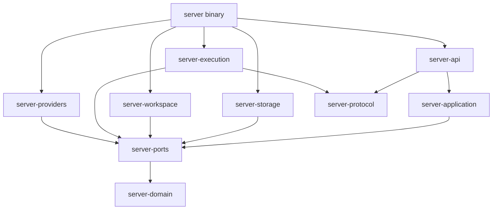

# ADR-022：独立 server 与全新内部 crate

- 状态：Accepted；用户已确认独立实现方向并授权在 `new` 分支实施。M0 已落地，业务与执行层仍按里程碑推进。
- 日期：2026-09-21。
- 用户约束：产物名为 `server`；暂时与 daemon 并存；所需内部 crate 全部新建。
- 领域基线：[ADR-001 v4](NEC-150/adr-001-core-domain-model-v4.md) 及其已接受修订。
- 实施顺序：[独立 server 实施计划](../plans/independent-server.md)。
- 当前实现与运行契约：[使用说明](../operations/independent-server.md)；M1 项目打开细节由 [ADR-023](adr-023-server-project-opening.md)落实。

## 1. 目标与适用范围

建设一个不需要现有 daemon、Desktop 或任何旧 Ait crate 的 Rust 服务端。首个可用版本支持
本机客户端通过 WebSocket 创建会话、提交输入、观察进度、处理审批、取消任务并重新读取历史。
服务端在客户端断开后继续管理已接纳的工作。

只共享根 Cargo workspace、工程规范和第三方依赖管理。新代码使用 `server-*` package 前缀；
`bins/server` 的 package 为 `server-bin`，显式声明 `[[bin]] name = "server"`。
不依赖、重导出或包装现有 Ait crate，不调用旧 daemon/ait-worker，不把旧实现复制改名当作新实现。
生产、测试和 build dependency 都遵守同一边界；新测试自行建立 fixture。

本 ADR 不修改旧 daemon 的行为，也不宣布旧实现被替代。以下变化仅适用于新 server：

| 既有决定 | 新 server 的处理 |
| --- | --- |
| ADR-001 v4 的 Message、Session、Run 不变量 | 保留语义，以新类型和新实现表达 |
| NEC-154 / NEC-169 的控制面与执行面隔离 | 保留进程隔离与单一持久化权威；使用新协议和新监督器 |
| ADR-017 的 `ait-worker` 执行入口 | 改为 `server` 自身的内部 worker 模式；旧服务继续使用原入口 |
| ADR-017 的原生历史确认、未知输入对账 | 作为首个 Codex adapter 的正确性要求；需用当前协议独立验证 |
| ADR-018 的旧目录、格式、锁和接管实现 | 新命名空间、新格式；不宣称与旧协议兼容或支持跨后端接管 |
| ADR-013 / ADR-017 的 Session worktree 路径 | 新 server 使用 `.ait-server/worktrees/<session-id>` |

首期不提供旧数据迁移、同目录双后端管理、已有原生 Thread 导入、远程监听、Relay、语音、
PTY、插件、MCP、Cron、自动 Git 提交或通用 API Provider 工具循环。领域类型不为这些后续功能
提前填满空接口；已声明的能力必须有实现和验收。

## 2. Paseo 参考范围

参考快照为 `getpaseo/paseo@2c8e8a826810337492cc5a38bb0bbd705b6fb632`。

| 源码 / 文档 | 采用的原则 | 在新 server 中的表达 |
| --- | --- | --- |
| [bootstrap.ts](https://github.com/getpaseo/paseo/blob/2c8e8a826810337492cc5a38bb0bbd705b6fb632/packages/server/src/server/bootstrap.ts) | 显式组装、启动与停止 | binary composition root 与受监督的任务树 |
| [websocket-server.ts](https://github.com/getpaseo/paseo/blob/2c8e8a826810337492cc5a38bb0bbd705b6fb632/packages/server/src/server/websocket-server.ts) | 握手、请求来源、背压、连接清理 | 每个物理连接独立的 `ClientConnection` |
| [creation/index.ts](https://github.com/getpaseo/paseo/blob/2c8e8a826810337492cc5a38bb0bbd705b6fb632/packages/server/src/server/creation/index.ts) | 接纳操作跨连接存活，结果不明要对账 | 持久化 operation、input intent 与 receipt |
| [timeline-sync.md](https://github.com/getpaseo/paseo/blob/2c8e8a826810337492cc5a38bb0bbd705b6fb632/docs/timeline-sync.md) | 实时预览与权威历史分离 | 可合并 delta + 持久化 Message path 与事件回放 |
| [protocol-compatibility.md](https://github.com/getpaseo/paseo/blob/2c8e8a826810337492cc5a38bb0bbd705b6fb632/docs/protocol-compatibility.md) | 能力显式协商，订阅拥有生命周期 | 版本握手、capability、subscription ID |
| [agent/mcp-server.ts](https://github.com/getpaseo/paseo/blob/2c8e8a826810337492cc5a38bb0bbd705b6fb632/packages/server/src/server/agent/mcp-server.ts) | MCP 是业务能力的 adapter | 后续 MCP 调同一 application use case |

Paseo 的 `Session` 是客户端连接/订阅上下文，不对应本项目业务 Session；`ManagedAgent`
跨越本项目 Agent 配置、Session 和 Run 的职责。其内存 timeline 与文件元数据存储也不作为
新 server 的领域或持久化模型。参考架构职责和可观察行为，不追求 Paseo wire compatibility。

## 3. crate 与依赖边界

除前期讨论的七个 crate，增加两个有实际职责的边界：`server-workspace` 负责本机目录/Git，
`server-execution` 负责父子进程及私有 IPC。它们分别避免 application 包含文件系统实现，
以及 provider adapter 同时拥有 Run 状态和进程监督。

| 新组件 | 责任 | 允许的 workspace 依赖 |
| --- | --- | --- |
| `server-domain` | ID、实体、状态转换、Message/Run 不变量 | 无 |
| `server-ports` | 原子持久化、Workspace、Execution、Provider、Clock 接口及语义数据 | domain |
| `server-application` | Project/Session/Run 用例、输入接纳、权限、恢复、事务编排 | domain、ports |
| `server-protocol` | 公共 WS DTO、独立的 worker DTO、版本、错误和 cursor envelope | 无；不重导出 domain 或 SDK 类型 |
| `server-storage` | 新 SQLite schema、迁移、receipt、outbox、分页 | domain、ports |
| `server-workspace` | 路径规范化、Git、worktree、目录租约与所有权 | domain、ports |
| `server-execution` | worker 启动、framing、握手、lease、进程树回收；实现 Execution port | domain、ports、protocol |
| `server-providers` | 首个 Codex adapter；协议映射、历史规范化、Provider port 实现 | domain、ports |
| `server-api` | Axum HTTP/WS、鉴权、ClientConnection、订阅、DTO 映射 | application、domain、protocol |
| `bins/server` | 两种进程模式的组装、配置、日志、信号与服务任务监督 | 上述新 crate |



图中省略表内列出的直接 domain 依赖。application 不依赖传输 DTO、SQLite 或 provider SDK；
adapters 不互相调用。binary 把接口实现注入 application，把 Provider 注入 worker handler。
`server-protocol` 的 public 与 worker 模块独立版本化，worker frame 不通过公共 WS 转发。

新增依赖边界检查遍历 `cargo metadata`：从 `server-bin` 和所有 `server-*` package 出发，
所有 workspace 内传递依赖都必须属于新集合，包括 dev/build dependencies。单独校验 domain
不依赖 Tokio、SQL/HTTP/IPC/UI/provider 实现。共享第三方库和 workspace lint 不算复用旧组件。

crate 按里程碑逐步创建；没有生产消费者的抽象和空 crate 不预先落地。

M0 实际创建 `server-protocol`、`server-api`、`server-bin`。当前 `server-api` 只依赖
`server-protocol`；binary 只直接依赖新 `server-api`，传递依赖仍限于新集合。依赖守卫作为 `server-bin` integration
test 随 `cargo test --workspace` 执行，包含未启用的 optional/platform/dev/build 声明边。

## 4. 一个产物、两个进程角色

建议交付一个 `server` 可执行文件：

```text
server --data-dir <directory> --listen 127.0.0.1:7316
  └─ server __worker                 内部模式，由父进程创建私有管道
       └─ provider process
            └─ provider-managed tools
```

这是新的监督器、新的 worker handler 和新的 IPC，不调用 `ait-worker`。内部模式只接受
父进程管道上的握手和 bootstrap，不提供监听端口，也不通过命令行接收 prompt、凭据、Run
内容或数据库路径。缺失握手立即退出。首期用 length-delimited JSON over stdio，stdout
专供协议，日志写 stderr；私有协议与外部 WS 协议分别协商。

主进程拥有 Project/Run 准入、全部数据库写入和最终状态。worker 拥有一个 execution scope
的 provider 连接，提出语义结果，等待需要的 commit ACK；不能直接打开业务数据库。
模型发现和历史读取可以使用辅助 scope，不伪造 Run。Run 执行 scope 在 native session
准备后绑定 Run，直到输入对账、历史发布、审批 drain 和资源回收全部完成才释放。

每次 worker 启动分配新的 `worker_instance_id + lease_epoch`；状态请求同时校验
`project_id + owner_epoch + run_id/scope_id`。旧 worker 的延迟结果不能更新新实例状态。
父进程 EOF、心跳失联、取消均进入受监督的停止流程；退出码只说明进程结束，不能证明 Run
completed。进程组/Job 等清理能力须分平台实测；进程隔离本身不等于 OS sandbox。

在确认子进程树已结束或原生 writer 已释放前，不得重新启动可能冲突的执行。确认不了时保存
`recovery_blocked`，仍可读取已提交历史。首期不加外层自动重启 supervisor；崩溃恢复先通过
手动重启 `server` 验证。

## 5. 数据与并存

建议默认布局如下，具体路径允许配置：

```text
~/.ait-server/
  config.toml                        非秘密启动配置
  catalog.sqlite3                    Provider/Agent preset、设置、项目注册索引
  instance.lock                      本 data-dir 的运行锁
  server-id                          本 data-dir 的稳定 UUID；每进程另分配 instance_id
  logs/

<project>/.ait-server/
  project.sqlite3                    项目领域事实与恢复依据
  project.lock
  worktrees/<session-id>/
```

`.ait-server` 目录必须在工作区建立本地 Git 排除；它不是模型输入或可提交产物。凭据只通过
环境变量或未跟踪的 `.env` 提供，数据库保存引用和非秘密配置，不复制原生 provider 登录态。
M0 仅从环境变量读取服务 token，不自动加载 `.env`。目录只初始化锁和身份文件；其余目录与
数据库随实际消费者创建。Project 排除规则与旧目录准入检查在 M1 的 workspace adapter 实现。

首期支持现有、具备有效 HEAD 的 Git root；非 Git 目录初始化是后续独立能力。Project
初始化保存稳定 ID、Git 基线和根 System Message。Session 在该 Project 的 Message 上建立
可移动指针，并使用自己固定的 managed worktree。目录创建是有 receipt 的外部操作，失败后
报告实际保留目录，不自动删除用户文件或把不明结果当作未发生。

持久化权威按边界划分：

| Catalog | 单个 Project |
| --- | --- |
| 全局 Provider 配置、Agent preset、默认选择 | Project identity、根指令快照 |
| 本机注册路径和可重建目录摘要 | Session、不可变 Message、Run、RunQueue |
| catalog 自身事件和操作 receipt | 冻结 Agent 配置、审批、input intent、执行 journal |
| catalog schema/stream identity | Project revision、owner epoch、receipt、outbox |

Message 追加、Session 指针 CAS、Run 状态、相关 receipt 和 outbox 在同一 Project 事务中提交。
跨 Project 操作不伪装成原子事务。Catalog 注册与 Project 初始化使用可恢复步骤和稳定 ID，
项目已落盘但 catalog 回执丢失时读取项目身份完成登记，不创建第二份项目历史。
执行前把使用的非秘密配置冻结在 Project；历史读取不依赖原 catalog 可用。

每个数据库有独立 schema family/version；新 server 拒绝把旧 SQLite 当成新格式打开。
首期不读取、转换或清理 `.ait/project.sqlite3`，也不复用旧协议的锁文件。新 server 实例之间
通过规范路径锁和独立于 data-dir 的本机 Project ID 锁协调，数据库 owner epoch 拦截旧写入。
锁顺序固定，释放必须发生在执行和存储任务 drain 之后。

与旧 daemon 并存的支持条件是：使用不同 data-dir、监听地址和独立 Git clone。首期项目打开
检查已知旧项目标记，并拒绝旧管理目录、其 Session worktree 和共享旧 Git common-dir 的路径。
新 server 只创建自己的原生 provider session，不导入旧服务持有的 Thread。

独立命名空间并不能提供新旧后端互斥；前述检查也无法阻止旧程序之后注册同一个目录。
因此首期不承诺这种混合使用安全。共享目录、旧项目接管和原生 session 互通需要后续的跨后端
协调协议，不能仅靠换端口或删除锁文件完成。

## 6. 领域与执行语义

领域新实现仍保持：

- Project 持有不可变 Message 树；Session 持有可 CAS 推进的指针，不拥有另一份历史。
- Agent 是版本化执行配置；Provider session/OS process 不是 Agent 领域身份。
- ToolUse 只能在 assistant sub-message 中；ToolResult 是特殊 user Message。
- Run 固定 Agent revision，重试、恢复和运行中接纳的队列输入都沿用同一 Run。
- Session 指针冲突不能覆盖他人指针；已确认结果保留为可恢复分支并报告冲突。

首个用例链：

1. 校验 Project ownership、Session version、Agent 配置、provider capability 和工作区准入。
2. 根据稳定 idempotency key 保存输入 operation。无活动 Run 时固定基准 Message/配置并建立
   Run；有活动 Run 时沿用其冻结配置，追加持久队列并递增 queue version，不创建并行 Run。
3. 先提交输入 intent 和接纳 receipt，再允许 worker 向 provider 发送。接纳回执只证明 server
   已持有工作，不证明 provider 收到了输入。
4. worker 发回实时预览、审批请求和可确认结果；application 校验完整事实并提交。
5. 当前 provider turn 结束后发布权威历史，处理剩余队列，然后检查 Run 终止屏障。
6. 在同一事务中比较 queue version、发布最终状态、清除 Session active Run 并写 outbox。
   CAS 失败则继续消费；终态后的新输入创建新的 Run。

首个 Codex adapter 延续原生历史确认原则：输入 intent 与 Message 分开。只有被原生历史确认
的用户输入和完整终态内容才物化为不可变 Message；stream delta 不直接变成持久 Message。
恢复时对已确认 provider identity 做幂等发布，不修改旧 Message，不伪造调用成功。
native 内容如何映射 ToolUse/ToolResult、完整历史分页和 writer 所有权，须在接入前形成独立
契约 fixture；暂不可映射的能力明确拒绝。

领域可以表达历史分支，但 provider 能否从任意历史节点继续是独立能力。首个真实执行版本先
支持 Project 根上的新 Session 与新 server 已绑定 Session 的继续；未经验证的 native fork、
历史 rewind 返回 `CAPABILITY_UNSUPPORTED`，不以拼接完整对话 prompt 模拟原生恢复。

客户端 idempotency 不等于 provider exactly-once。向 provider 发送前保存“可能已发送”状态；
断线或 worker 退出且无确定回执时保留 unknown，通过原生历史对账。无法确定时进入
`recovery_blocked`，不自动重发。明确尚未发送的队列项与未知发送项分别结算。

Run 完成屏障至少检查：工具/审批已结算、无待执行 retry、无 compaction/recovery/checkpoint
工作、完整历史/使用量已持久化、队列为空且版本未变化、没有未知输入或仍可写入的执行者。
首版不启用自动 retry 或 host compaction 时，相应集合为空；不能据此删去屏障条件。
排队输入先在当前 turn 后串行消费，实时 steer 是后续独立 capability。

## 7. 公共协议

HTTP 首期只承担 `/healthz`、`/readyz`、`/v1/server/info` 和 `/v1/ws` upgrade。业务操作走
同一 WS RPC contract；暂不维护一套平行的 REST 业务路由。所有业务入口最终调用 application。

### 7.1 身份与握手

| 标识 | 语义 |
| --- | --- |
| `server_id` | data-dir 中持久化的服务身份 |
| `instance_id` | 每次主进程启动生成，标识连接与运行实例 |
| `client_id` | 客户端提供的诊断标识；不是认证身份或订阅归属证据 |
| `connection_id` | 服务端为一个物理连接分配；该连接拥有请求和订阅 |
| `request_id` | 当前连接的一次 RPC 关联 ID |
| `operation_id` / `idempotency_key` | 持久化业务操作与客户端重试关联，不随连接变化 |
| `subscription_id` | 服务端分配的连接内订阅身份 |

先在 upgrade 边界完成凭据及 Host/Origin 校验，再接受 `hello`。hello 声明 major/minor 范围、
客户端支持/必需 capability；server_info 返回协商版本、交集、实例信息和预算。未握手、无版本
交集或缺少必需 capability 时拒绝业务消息。同 major 新增字段保持可选；不支持的方法返回
稳定错误。能力缺失不自动绕到旧 daemon。

首期仅允许 loopback，业务 HTTP/WS 使用环境变量提供的 bearer credential。令牌不放 URL，
不进入日志；无认证 health 只输出最小存活状态。浏览器客户端凭据承载方式须在其接入时测试，
不能以关闭 Origin 校验代替。非 loopback、TLS 和远端授权另行设计。

### 7.2 最小方法集合

以下为新协议提案名称，不是现有 Ait/Paseo endpoint：

| 方法 | 语义 |
| --- | --- |
| `project.open/list/get/close` | 打开新格式项目、读取目录与状态、排空后释放 |
| `agent.configure/list` | 配置并选择版本化 Agent，完成无 UI 初始化 |
| `provider.list/models` | 返回实际可用能力和模型；辅助 worker 执行发现 |
| `session.create/list/get` | 创建指针和工作区，读取会话 |
| `session.input.submit` | 持久化接纳输入，返回 operation/Run/queue 回执 |
| `session.history.page` | 按固定 head Message 分页读取不可变路径 |
| `run.get/cancel` | 查询 Run；持久化取消意图并监督停止 |
| `approval.list/resolve` | 读取/处理仍有效的审批；首期仅一次 grant |
| `operation.get` | 查询结果不明的客户端请求 |
| `events.subscribe/unsubscribe` | 以明确 scope/filter 订阅与解除订阅 |

写请求携带 `idempotency_key` 和必要的 expected version/owner context。去重范围为认证主体、
catalog/Project scope、方法和 key；相同规范化业务参数返回同一 operation，参数不同返回
`IDEMPOTENCY_CONFLICT`。request_id、连接 ID、owner epoch 和重试次数不进入业务 fingerprint。
先查已提交 receipt：存在时只读返回；不存在时才以当前 version/owner 做新准入。这样旧请求
可以在重启后查回回执，却不能凭过期 owner 发起新的写入。认证与读取授权始终先于 receipt 查询。
首期不回收写操作去重记录，后续保留策略必须给出过期 key 的对账规则，不能把旧重试静默当作新请求。

统一错误包含 `code`、安全 message、`retryable`、可选 operation ID。连接超时不表示操作
失败或取消；客户端先按 key/operation 查询。已提交接纳回执和后续列表读取分离，读取失败
不回滚已经启动的任务。

## 8. 历史、实时输出与订阅

持久事件使用 `{stream_id, seq}` cursor；stream_id 随 catalog/Project 持久化，进程重启
不更换。instance_id 改变表示连接重建，不能直接作为历史失效的依据。各 Project 和 catalog
有自己的序列；首期一个订阅对应一个 stream/scope，不提供伪造的跨库全局顺序。

- 权威历史来自新 Project SQLite，原生内容经确认后幂等物化。`session.history.page` 固定
  `head_message_id`，后续 Session 推进不改变本次分页路径。
- durable event 与业务事实同事务写 outbox；网络发送为至少一次，客户端按 stream/seq 去重。
- token/reasoning/tool 预览允许合并，使用独立 attempt/progress sequence，不能冒充 durable cursor。
- 首次订阅先建立有界唤醒源，再在一致读取中获取快照和高水位；此后从 outbox 重放高水位之后
  的事件并持续追赶。唤醒只是提示，正确性不依赖内存广播是否丢失。
- RPC 先返回 subscription ID 与 bootstrap/cursor，再交付该订阅事件；按 scope/filter 路由。
  unsubscribe ACK 之后停止该订阅的输出。连接断开释放其订阅，不取消 Run。
- 重连创建新的 subscription ID，并带上旧 durable cursor。游标不属于当前 stream、超出保留
  范围或恢复读取不成立时明确返回 `resync_required`，重新取快照；不能假装已补齐。

按 Session/Run 过滤的订阅允许 seq 不连续；服务端报告已扫描水位，不把被过滤的其他实体事件
误判为网络缺口。客户端重连携带的 cursor 表示它已接受的覆盖水位，不能直接采用尚未消费的
服务端最新值。首次快照/回放期间的缓存同样受连接预算约束，溢出就明确重同步。

M0 已落实：公共 JSON frame/message 1 MiB；每连接最多 256 个待发 frame 且总计不超过 4 MiB，
进行中的 socket write 仍占字节预算。后续业务预算建议：分页最多 200 项且编码后不超过
512 KiB；每 Run 排队输入最多 64 项。数值在流式/慢客户端
实测后调整。单项大内容走有边界的内容分页/引用，不能仅限制条数。durable event 主要携带 ID、
版本和有限摘要，避免把完整 transcript 放进通知。

慢客户端可以丢弃/合并预览并被要求重新同步；durable backlog 超出连接预算时断开该连接，
保留可回放 cursor。不能让客户端发送队列反向阻塞 worker 提交事实。

## 9. 启动、关闭和恢复

配置优先级为 CLI > 环境变量 > config.toml > defaults，秘密值不接受命令行选项。
默认 `127.0.0.1:7316` 与 `~/.ait-server`，避开现有 Desktop 的 7314/7315；允许端口 0
用于测试，并在 server_info 报告实际地址。

启动顺序：

1. 解析配置、初始化脱敏日志，验证 loopback。
2. 先保留监听地址；失败时尚未修改项目或接管执行。
3. 获得 data-dir 运行锁，打开并验证新 catalog，生成 instance ID。
4. 分类已有未终态 operation/Run，按需获取项目锁并恢复；普通目录列表不占用全部项目。
5. 启动 API 及受监督任务，发布 ready。Project/provider 不可用作为明确局部状态，不能伪造可执行。

M0 的第 3 步只持有锁并验证/初始化 server identity；尚无 catalog，第 4 步随 M1/M2 加入。

`healthz` 只表示进程能响应；`readyz` 表示 catalog 和准入服务可用，draining 时返回非 ready。
单个 Project 的 recovery_blocked 不阻断其他项目的读取/执行。

关闭顺序：停止新连接和业务准入 → 等待已接纳短事务 → 持久化取消/中断意图 → 监督 worker
停止 → 提交可确认事实和 unresolved 状态 → 停止订阅及恢复任务 → flush 数据/日志 → 释放锁。
必须持续 poll/await server 和 task handles，不能仅发送 shutdown 信号就丢弃 future。
初始 grace/hard deadline 建议 15s/30s，仅约束关闭，不作为 Run 总运行时限。
M0 没有 worker 和业务事务，只使用 15s 的进程 drain 上限；超时非零退出。

## 10. 验证与完成定义

首个真实 Provider 版本的完整验收包含：无 Desktop 的配置与运行；断线不丢接纳任务；
重试不重复提交；审批恢复；排队输入与完成竞争；慢客户端隔离；正常关闭及 kill/restart；
未知 provider 输入不重发；旧 worker/旧 owner 写入拒绝；新旧服务在独立项目下并行运行。

所有 Rust 修改遵守 [Rust style guide](../policy/rust.md)，测试模块拆到 child files。
每阶段先建立新接口契约测试，再用临时 SQLite、独立 Git fixture 和受控子进程测 adapter；
真实 provider smoke 明确区分于离线验收。实现报告记录 workspace 和新 crate 的覆盖率、
测量命令/revision/features、平台范围和可评审 artifact，不以测试数量代替覆盖率。

当前实现边界以使用说明、ADR-023 与 [ADR-024](adr-024-server-agent-configuration.md) 为准。
M1 已实现 Project 数据库、打开回执恢复、Agent 配置/revision 与显式默认选择；
Session/Run、同 binary worker 模式与执行恢复仍为后续工作。
