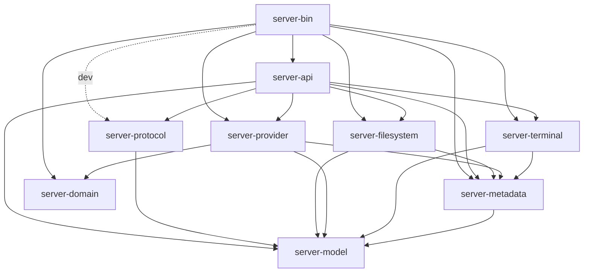

# ADR-038：server-protocol 仅依赖公共 server-model

- 状态：Accepted。
- 日期：2026-09-25。
- 授权：清理 server-protocol 对四个能力包的依赖，并绘制 server 内部依赖图。
- 范围：修订 ADR-037 的协议依赖边；不改变请求、事件、错误码或领域模型。

## 决策

`server-protocol` 的直接 workspace 依赖只允许 `server-model`。移除 metadata、filesystem、
provider、terminal 四条依赖，普通、开发、构建、optional 和 target-specific 依赖遵守同一边界。

统一 ErrorCode 与响应信封已归 server-model，业务错误到公共错误的转换已在各能力包实现。
对应的 metadata/provider 错误码测试迁到各自 rpc 子测试文件，保留全部断言；不通过
dev-dependency 把能力包重新引入 protocol。

四个基础连接方法的 CAPABILITIES 常量归 server-model::server，与公共版本、预算和
ServerInfo 同处。metadata/protocol 的旧导出路径保留，实际处理与安装规则继续由 metadata
声明。具体业务方法的名称仍归各能力包；protocol 的静态 Paseo 目录像其他条目一样记录
Skills 和 heartbeat 的规范字符串。API 的集成测试检查文件、Skills、基础能力和 heartbeat
之间的一致性，避免为复用几个字符串建立业务依赖。

server-model 仍拥有 Tokio Runtime/Context，并非纯领域包。本次 protocol 仍通过 model
间接使用 Tokio 依赖树；domain 的纯领域边界保持不变。能力包不反向依赖 protocol/API。

## 当前内部依赖图

箭头表示 Cargo 直接依赖；实线为普通依赖，虚线为开发依赖。不绘制第三方 crate。

| Crate | 普通直接 workspace 依赖 | 开发依赖 |
| --- | --- | --- |
| server-bin | api、domain、filesystem、metadata、provider、terminal | protocol |
| server-api | filesystem、metadata、model、protocol、provider、terminal | 无 |
| server-protocol | model | 无 |
| server-filesystem | metadata、model | 无 |
| server-provider | domain、metadata、model | 无 |
| server-terminal | metadata、model | 无 |
| server-metadata | model | 无 |
| server-model | 无 | 无 |
| server-domain | 无 | 无 |

表格的依赖列省略 server- 前缀。bin 组装具体服务，API 负责 HTTP/WS 与跨能力收尾；
provider/filesystem/terminal 通过 metadata 端口使用 Project/Workspace 信息，公共模型与
运行资源归 model，Agent 纯领域值归 domain。

## 验证

架构守卫拒绝 protocol 对业务包的普通、dev、build、重命名、optional 和平台条件边。
协议协商、静态方法目录、业务错误码映射以及真实 WebSocket/进程回归验证兼容性。
命令、测试计数和覆盖率见[实施报告](../reports/server-protocol-dependencies.md)。
