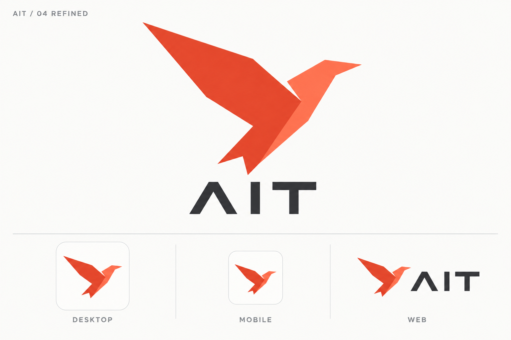
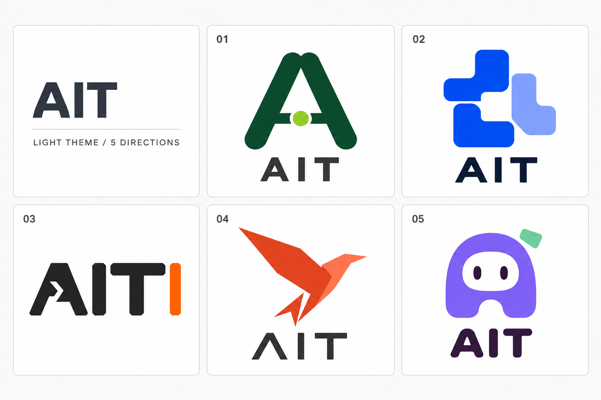

# ADR-051：AIT 品牌识别与日间视觉系统

- 状态：Accepted（品牌方向与日间设计基线；生产资产尚待制作和接入）
- 日期：2026-09-26
- 版本：BI v1 / Light
- 范围：AIT 品牌定位、标志、字标、日间配色、跨端应用及设计资产管理。
- 决策依据：五款候选方案中的 **04 飞鸟**，以及其日间精修稿。
- 关联：[核心领域模型 ADR-001 v4](NEC-150/adr-001-core-domain-model-v4.md)。

## 1. 背景与决策

AIT 的品牌定位是：**跨多端的 Agent 平台，统一连接与使用多种云端 Agent 服务。**
本轮从路径字母、模块协作、终端字标、折纸飞鸟、亲和小助手五个方向中选择了飞鸟。
选择依据是飞鸟能够表达跨端流动、连接与行动，适合作为平台品牌持续使用。

采用橙红色折纸飞鸟作为主标，配合深炭色大写 `AIT` 字标，建立日间视觉系统。
桌面、移动端与网页共用同一主标，通过组合形式和容器适配场景。

这里的 BI 指 Brand Identity（品牌识别）；本 ADR 固化本轮品牌与日间视觉设计，
包括已有设计图及后续实现需要遵循的规则。配色数值、留白和尺寸是本 ADR 补充的
实施基线；它们尚未经过生产矢量稿和实际客户端的验收。

品牌定位不扩大当前产品已实现的能力。对外描述具体服务与平台支持情况时，应以
实际可用功能为准。本决策不改变本地优先原则、数据归属、领域模型或 Provider 边界。

## 2. 视觉基准与资产权威

精修图是本轮主视觉参考；初稿和其余候选图用于保留决策过程。图中的应用图标是
排版示意，不是已完成的平台导出资产，也不代表这些客户端已更换图标。

后续制作以本 ADR 的规则和精修图的轮廓为依据，建立唯一矢量母版，再从母版派生
各端资源。生成图中的轻微色差、纹理、抗锯齿和不同展示尺寸之间的细节差异不应复制
为品牌规则。精确路径以日后验收的矢量母版为准，不把 PNG 展示板直接当作母版。

## 3. 品牌表达

| 元素 | 品牌含义 | 设计要求 |
| --- | --- | --- |
| 向右上方飞行的鸟 | 跨端流动、向前执行任务 | 保持明确方向与轻快姿态 |
| 汇合的折面 | 多种云端 Agent 服务汇入统一平台 | 用少量面构成一个整体，不按供应商数量增加部件 |
| 连贯轮廓 | 跨端一致的品牌体验 | 各端使用同源图形 |
| 橙红与珊瑚色 | 活力、行动、可识别性 | 作为品牌强调色，配合大面积浅色背景 |
| 深炭色 AIT 字标 | 清晰、稳定、工具属性 | 在日间背景上保持可读性 |

语气采用简洁、清晰、开放的产品表达。平台品牌保持供应商中立；具体 Agent 服务
的名称和标识在服务选择等上下文中独立展示，不合并进 AIT 标志。

本轮不确立英文全称或固定口号。视觉字标统一写作 `AIT`；现有产品元数据中的
`Ait`、包名、应用 ID、命令和 URL 的大小写沿用各自约定，不能因字标规则自动重命名。

## 4. 标志结构

### 4.1 主图形

保留左上方展开的大翼、指向右上方的头部与紧凑分叉尾部。图形应呈现一只抽象飞鸟，
由两至三个主要折面组织，不绘制眼睛、羽毛或具象身体细节。

尾部与身体保持整体关系，去掉初稿中游离的小箭头和细碎尖片。折面交界与留白需要
在小尺寸下可辨，不能依赖发丝宽度的间隙或边线。

使用平面填色；折面由颜色区分。主图形不增加渐变、阴影、立体挤压、光晕或材质。
不往图形中加入云朵、设备、供应商 Logo、网络节点或连线。跨端与云服务的含义由
整体形象和品牌叙述共同表达。

### 4.2 字标与辅助文字

字标采用精修稿中的大写几何 `AIT`：笔画有力度，A 为开放式几何结构，I 与 T 清晰。
字距以视觉平衡为准；矢量化后应以路径保存，不依赖用户设备是否安装某款字体。

生成稿没有提供可交付字体文件或已确定的字体家族，不能把近似系统字体声明为
原始字标字体。辅助说明和产品正文沿用各端系统无衬线字体，不模仿字标绘制正文。
品牌设计本身不要求新增字体依赖或统一替换现有 UI 排版。

### 4.3 标准组合

| 形式 | 组成 | 使用场景 |
| --- | --- | --- |
| 独立图形 | 飞鸟，不含字标 | App 图标、favicon、窄导航与已明确品牌的入口 |
| 横向组合 | 飞鸟在左，AIT 在右 | 网页页头、桌面导航、文档页眉 |
| 纵向组合 | 飞鸟在上，AIT 在下 | 启动页、品牌封面、较大展示空间 |
| 单色图形 | 同一轮廓的深炭色版本 | 单色输出、系统模板图标及极小尺寸候选 |

单色与小尺寸专用版本是后续母版的派生要求，本轮尚未制作。不能用独立的 A 字母
代替已选定的飞鸟作为默认 App 图标。候选 01、02、03、05 不作为并行生产品牌。

## 5. 日间色彩

以下 sRGB HEX 是从已选橙红方向规范化的颜色基线，供矢量化与导出使用；
它们不是对生成图逐像素取样得到的唯一颜色。后续生产资产使用下表的纯色，避免
不同客户端各自从 PNG 中取色。正式调整色值需要记录为本 ADR 的修订。

| 品牌色令牌 | HEX | 用途 |
| --- | --- | --- |
| `brand.primary` | `#EF4B2C` | 主翼与主体折面 |
| `brand.secondary` | `#FF704D` | 朝前的浅色折面 |
| `brand.ink` | `#25282B` | AIT 字标、单色主标 |
| `brand.canvas` | `#FAFAF8` | 日间品牌展示底色 |
| `brand.surface` | `#FFFFFF` | 图标容器与白底展示 |
| `brand.border` | `#D8DADD` | 展示板或容器的辅助细边框 |

品牌色令牌属于本设计规范，尚未写入应用主题。`brand.border` 是承载面样式，
不属于飞鸟图形路径。默认使用白色或暖白背景；透明图形应放在明确的浅色承载面上。

橙红色用于品牌强调，不直接成为错误、警告、运行中或成功的唯一表示。
界面文字、控件和状态需要独立完成对比度及可用性验证；本轮不宣称整套 UI 已通过
无障碍验收。深色主题的配色、反白及对比度另行设计，本 ADR 不规定夜间版本。

## 6. 比例、留白与小尺寸

下列尺寸是生产母版的起始约束与验收目标，精修展示图不构成尺寸测试结果。

1. 以独立飞鸟的可见图形高度为 `H`，周围最小净空为 `0.2H`。
   净空内不放文字、装饰或无关控件；横向、纵向组合的内部间隔也从 `0.2H` 起调。
2. 以完整组合的外包围框计算对外净空，不能让字标抵近容器边缘。
   所有缩放保持原始宽高比，以视觉重心校正居中，不单独压缩翅膀或尾部。
3. 常规独立图形以 **24 px 高度**作为最小使用基线；字标可见高度以 **16 px**
   作为组合使用基线。空间不足时只使用飞鸟，不强行塞入完整字标。
4. **16 px favicon** 必须制作和检验专用光学校正版，可合并折面为单色并简化内部
   细节，保持头部、主翼和尾部的关键轮廓。不得直接把大幅展示板缩到 16 px。
5. 通用方形展示容器中的飞鸟最大可见边长以容器边长的 **70%–76%**为起点，
   为翼尖和系统裁切留出余量；具体平台的遮罩与安全区要求优先于该展示比例。
6. 验收必须覆盖 16、24、32、48、64、128 px 的实际栅格显示。
   任一尺寸轮廓糊合、尖角断裂或折面不可辨时，应调整对应派生资产。

## 7. 跨端应用

| 场景 | 品牌形式 | 实施要求 |
| --- | --- | --- |
| 桌面应用图标 | 飞鸟独立图形，日间浅色底 | 按平台打包流程从同一母版生成图标；检查 Dock、任务栏及列表显示 |
| 移动端应用图标 | 飞鸟独立图形 | 分离品牌前景与平台承载背景，按目标平台遮罩和安全区验证；不从展示板裁出圆角框 |
| Web / PWA | 页头横向组合；favicon 使用独立图形 | 小尺寸 favicon 单独验收，安装图标使用相同母版与配色 |
| 启动页与欢迎页 | 纵向组合 | 使用白色或暖白底，保留净空；不把整张精修展示板作为启动图片 |
| 文档与发布物 | 横向或纵向组合 | 使用固定色值与比例，搭配正常排版的标题和正文 |
| 运行、提醒等状态 | 保持基础飞鸟标志 | 通过独立徽标、文字或状态组件表达，不改变鸟的飞行方向或折面结构 |

不同平台容器可以不同，主标的几何关系、朝向和色彩角色必须一致。
透明底是资产格式选项，不代表夜间主题；当前日间图形不能未经检查直接置于深色背景。

## 8. 辅助视觉与禁用方式

品牌页面可复用飞鸟的斜向折面和大面积留白作为辅助视觉，强调单一向前的动势。
辅助图形只用于适量装饰，不进入复杂数据区或遮挡正文；不为每个供应商设计一只
不同颜色的 AIT 飞鸟。

以下用法不符合本基线：

- 镜像、旋转、更改朝向、非等比拉伸，或裁断主翼、头部与尾部。
- 重组折面、增加羽毛、把图形改成普通纸飞机，或混入其他候选方案的元素。
- 用供应商配色重涂 AIT 主标，或将第三方 Logo 嵌入飞鸟。
- 依赖渐变、发光、厚重描边、阴影或 3D 效果识别图形。
- 把 `04`、`REFINED`、`DESKTOP` 等展示板标注带入正式 Logo 资产。
- 直接从生成图裁切应用图标，或把低分辨率 PNG 放大充当矢量源。

## 9. 备选方案与取舍

| 方案 | 优点 | 本轮取舍 |
| --- | --- | --- |
| 01 路径字母 A | 稳定、简洁，延续字母识别 | 对跨端平台的流动性表达较弱，归档保留 |
| 02 模块协作 | 易表达多个组件协作 | 更偏结构与编排，归档保留 |
| 03 终端字标 | 开发者工具属性直接 | 品牌联想更偏终端，归档保留 |
| **04 折纸飞鸟** | 跨端流动、向前行动，可形成独立图标 | **选为统一品牌方向，并以精修稿继续制作** |
| 05 亲和小助手 | 亲切、角色记忆点明确 | 更偏单个助手角色，归档保留 |

飞鸟的代价是无法只靠图形完整解释云端服务接入，需要产品描述配合；
尖角与折面也要求专门的小尺寸处理。采用该方向时，优先保证轮廓和跨端一致性，
而非增加图形细节来承载每项功能。

## 10. 归档资产与来源

正式设计依据保存在 [`docs/assets/brand/ait-day-v1/`](../assets/brand/ait-day-v1/)，
文档只使用仓库内相对路径，不依赖个人目录或 imagegen 的缓存位置。
原 `output/imagegen/ait-day-concepts-20260926/` 中的重复文件仅在本地保留为被忽略的生成输出；后续设计和
实现应引用此处归档及本 ADR。

| 资产 | 用途与状态 |
| --- | --- |
| [04-swift-refined.png](../assets/brand/ait-day-v1/04-swift-refined.png) | 选定方向的日间精修与跨端应用参考，1536 × 1024 PNG |
| [04-swift.png](../assets/brand/ait-day-v1/04-swift.png) | 选定方向初稿，1254 × 1254 PNG |
| [00-light-theme-comparison.png](../assets/brand/ait-day-v1/00-light-theme-comparison.png) | 五方向白底对比板，1536 × 1024 PNG |
| [01-path-a.png](../assets/brand/ait-day-v1/01-path-a.png) | 路径字母 A 候选，归档 |
| [02-modular.png](../assets/brand/ait-day-v1/02-modular.png) | 模块协作候选，归档 |
| [03-terminal.png](../assets/brand/ait-day-v1/03-terminal.png) | 终端字标候选，归档 |
| [05-companion.png](../assets/brand/ait-day-v1/05-companion.png) | 亲和小助手候选，归档 |
| [PROMPTS.md](../assets/brand/ait-day-v1/PROMPTS.md) | 五方向及白底对比板的完整生成提示词 |
| [04-swift-refined-prompt.md](../assets/brand/ait-day-v1/04-swift-refined-prompt.md) | 精修完整提示词与品牌背景 |

全部图稿由内置 image_gen 生成，精修以 04 初稿为编辑目标。提示词保留的是生成
过程记录，不保证再次生成相同像素；可复用实现应以验收后的矢量母版及确定性导出为准。

## 11. 落地顺序与验收

本次交付为 ADR、设计图与提示词归档、文档索引，不修改现有客户端品牌资源。
设计方向已确认；生产 SVG、单色版本、小尺寸版本、各平台导出与代码接入属于后续工作。

后续工作区整合同时提交了现有 `/logo.svg` 字母 A 图形在 App、favicon、启动页及
Electron 图标中的接入。这些资源不属于本 ADR 的飞鸟生产稿，飞鸟方向的制作与验收仍待实施。

后续按以下顺序实施：

1. 根据精修稿制作可编辑的飞鸟 SVG 母版与路径化 AIT 字标，应用本 ADR 的纯色令牌。
2. 从母版制作独立图形、横向组合、纵向组合、单色版及 16 px 光学校正版。
3. 检验留白、比例、浅色背景显示及全部目标小尺寸，保留验证图。
4. 从同一母版通过确定性流程导出桌面、移动端和 Web 资源，建立源文件与产物对应关系。
5. 在实际客户端检查系统遮罩、启动页、导航、favicon 和状态徽标，再替换生产引用。
6. 记录落地报告、资产路径与验证结果；需要改变轮廓或色彩基线时修订本 ADR。

验收以实际产物为准：字标必须准确读作 AIT；小尺寸轮廓清楚；系统裁切不损伤翼尖；
跨端图形同源；产物不带展示板标注；应用状态无需仅靠品牌色区分。

夜间主题、动态标志、完整营销模板和印刷色彩规范不在本轮确认范围，需要后续设计。

## 12. 验证与工程边界

2026-09-26 归档检查结果：ADR 及两份提示词文档的 20 个相对链接均可解析；
7 张 PNG 的文件结构、校验和、图像数据解压与尺寸检查通过；原始 9 份归档文件与生成
输出的 SHA-256 一致。整合提交前仅清理 `04-swift-refined-prompt.md` 的多余末尾空行，
其余 8 份文件仍与输出完全一致；文档索引和 Markdown 行尾空白检查通过。

本 ADR 没有 Rust 或运行时行为变更，不新增单元测试；品牌视觉验收不能由 workspace
测试替代。生产图标的小尺寸、遮罩和客户端验证在本次归档时尚未执行。

现有架构约束继续生效：不更改 Message、Session、Run、Provider 的含义与职责，
不把视觉或 UI 依赖引入 `domain`。该 ADR 是品牌决策的持久记录，不是架构迁移授权。
